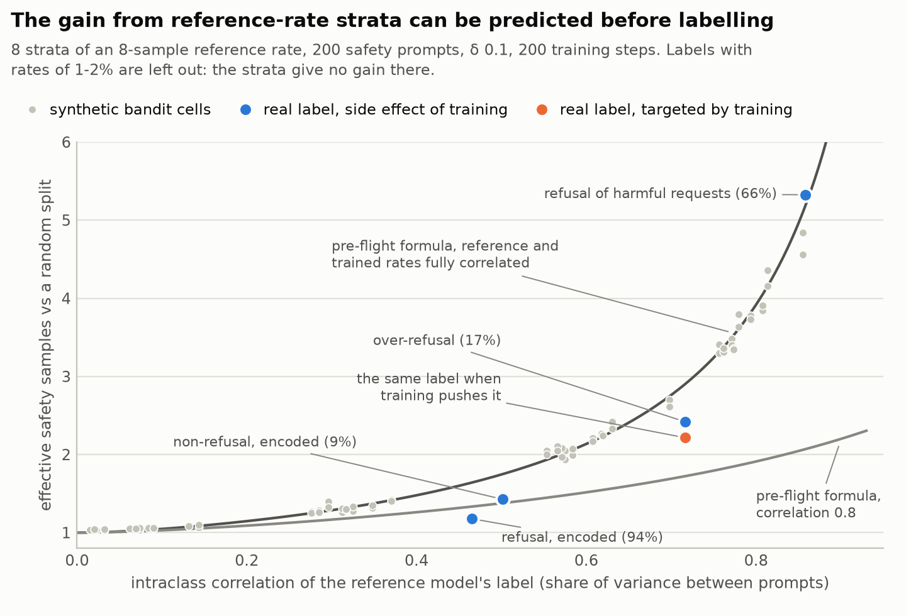
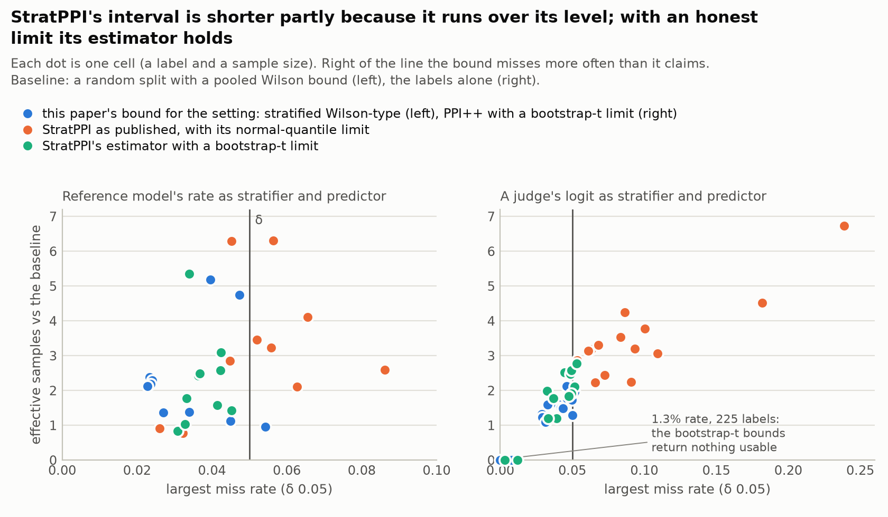
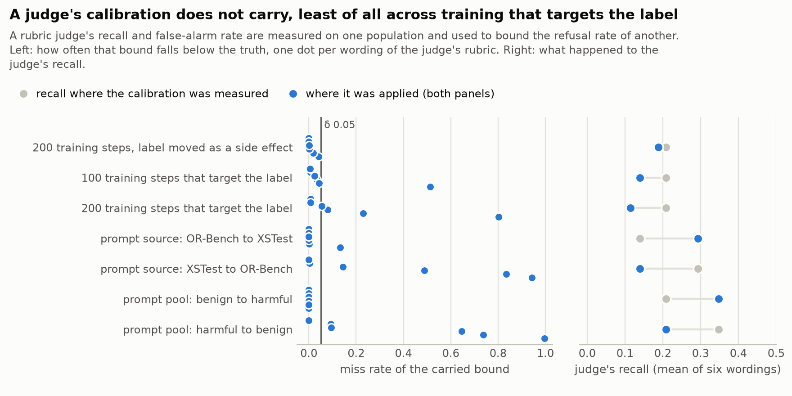
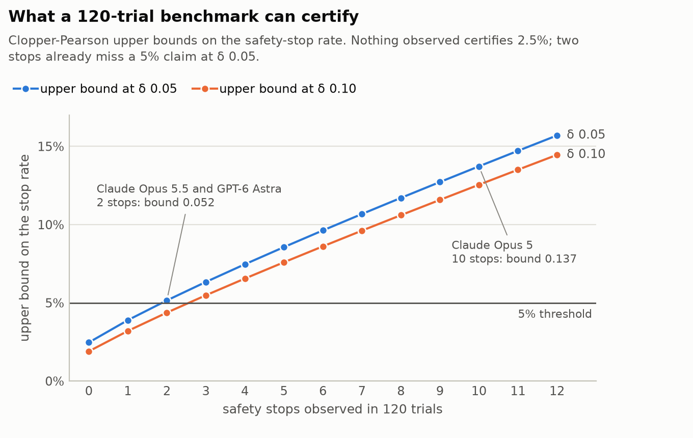
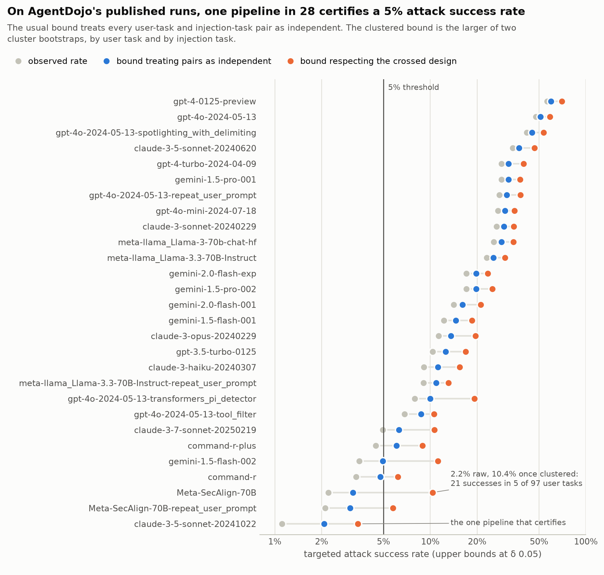
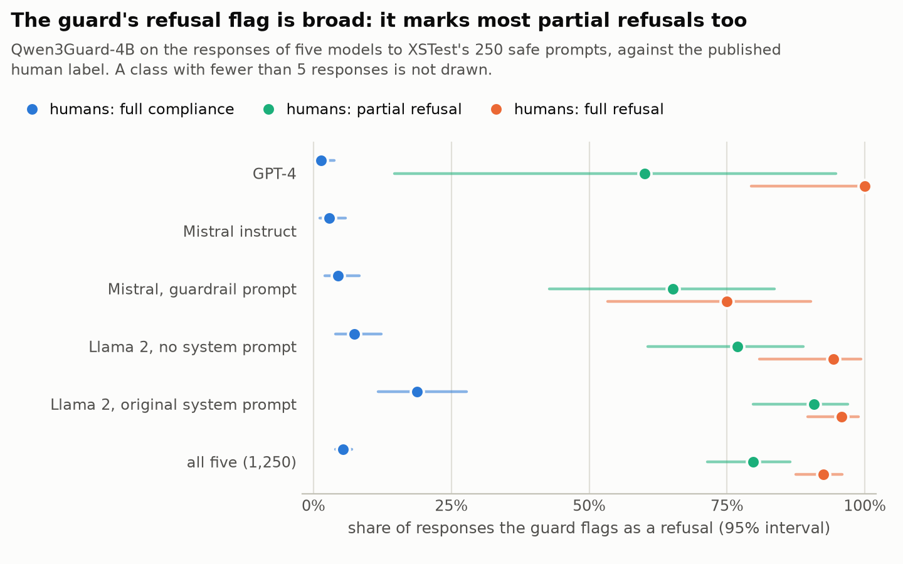
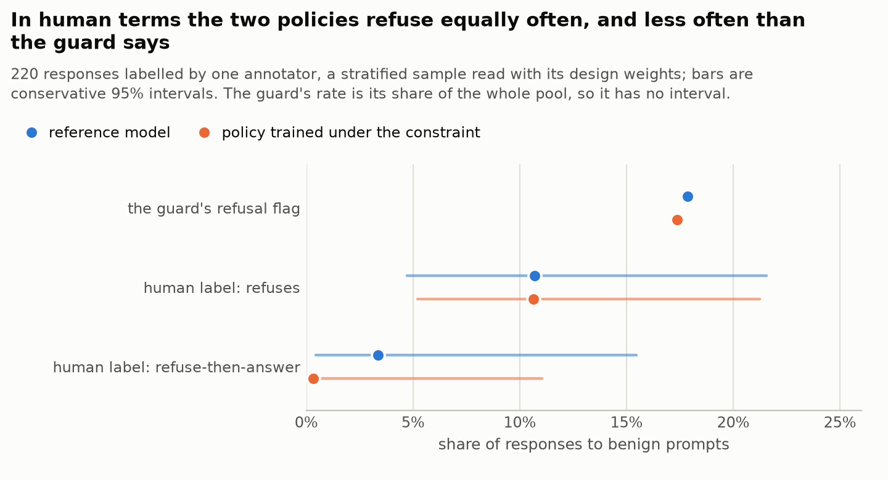

# Certifying behaviour rates of language-model policies: what holds, what a label buys, and what does not carry

*Draft of 2026-10-08, not formatted for any venue. Generated from the working draft by
`scripts/paper_clean.py`; to change the text, edit the working draft and run the script again.*

## Abstract

A Seldonian algorithm (Thomas et al., 2019) returns a solution only when a high-confidence
test on held-out data supports a stated constraint, and otherwise returns "no solution found".
Used to post-train a language model, its last step, the safety test, is a one-sided confidence
bound on the rate of a judged behaviour. We take that test on its own, as a certificate for a
fixed policy, and audit it against known truths: synthetic environments, resampled real
responses, and published traces of frontier models. No exact bound was over its level in any
cell where its sampling assumption held, and the checks put its miss rate under 0.059 at a
nominal 5% (the largest upper limit of a 95% interval over cells). The normal-quantile
intervals of PPI++ and StratPPI miss in up to 24% of draws at a nominal 5%; with labels
allocated in proportion to stratum size and strata that are fixed, a bootstrap-t limit is
over its level in no cell of the pools it was developed on, with a miss rate under 0.064 by
the same measure. Stratifying the safety set by the reference model's own per-prompt
rate multiplies the effective sample by 1.4 to 5.3 at delta 0.10 (1.4 to 5.1 at 0.05) for labels at rates of 9% to 66%, under a
strata rule chosen on the same data. Those gains are for the rate over the prompt pool itself,
and the bound behind them is approximate. It kept its
level where the safety set was 20-40% of its prompt pool; with a much larger pool it runs up
to 1.2 points over a 5% level on labels at rates of 65% and above, which is where the largest
gains are. For the rate over the source the pool was drawn from, the gain on the same labels
is 1.3 to 2.4 at delta 0.05, under a limit with an added term that was over its level in none
of the mid-rate cells there; the bootstrap-t limit fails for that claim. On three new prompt
pools, with eight predictions registered first, six were kept: the gain was 1.5 to 1.6 (1.2
to 1.3 for the source), within 20% of a pre-flight prediction, and the Wilson-type bound was
again over its level at a high rate and not at a low one. Two were refuted: a bootstrap-t
limit was over in one mid-rate cell of eight, and the Wilson-type bound with the added term
was over at the high rate. A stratified Wald-t limit was over in none of the mid-rate
cells, with no gain at the high rate. Three things do not carry: a judge's
calibration, across prompt populations or across training that targets the label;
independent-sample bounds on crossed benchmark designs; and a stratified labelling sheet read
as a random sample. On AgentDojo's published runs the usual per-pair bound is over its level
for 27 of 28 pipelines, and one of 28 certifies a 5% attack success rate under a bound
clustered by user task. None does under the one bound that also held with injection tasks
sampled. A certificate of a trained policy in human labels is costed and
prepared, not run. A normal-approximation budget at the measured difference of about zero puts
a 2-point refusal margin at about 420 labelled prompt pairs for an even chance of passing; in a
check of the design with synthetic labels, 300 pairs certify a margin of 3.7 points with an
approximate limit and 6.5 with the exact one.

## 1. Introduction

Reports on language-model policies state rates: how often a model refuses a benign request, how
often a tool-using agent follows an injected instruction, how often a robot controller trips a
safety stop. A decision to deploy needs a different object: a statement that
the rate is at most some threshold, together with the chance that the statement is wrong. We
call that statement a certificate.

The Seldonian framework (Thomas et al., 2019) produces this object as the last step of a
learning algorithm. The algorithm searches for a solution on one part of the data, tests it on
a part the search never saw, and returns it only if a one-sided confidence bound at level
delta puts the constrained quantity under its threshold. Otherwise it returns "no solution
found" (NSF). Sections 2 to 4 set out the algorithm, its use to post-train a language model,
and the theory of each step.

Three features of language-model evaluation can each void the guarantee without any visible
sign. The label is not observed: a guard model, a rubric judge or a benchmark harness produces
it, and its errors differ from one population of responses to the next. The sample is rarely
independent: benchmarks cross tasks with attacks, and failures cluster. And the policy has
often been trained against the label that is then used to certify it. The rates of interest are
also small, which is where normal approximations are known to fail (Bowyer et al., 2025).

This paper does not propose a new way to train. It takes the safety test, applies it to
policies that are fixed by the time they are tested, and asks when its guarantee holds for a
language model, what it costs in labels, and what breaks it. Section 5 states the proposal,
section 6 the set-up of the evaluation, and sections 7 to 10 the results.

## 2. The Seldonian algorithm

A standard learning algorithm returns the parameters `theta` that score best on an objective,
and promises nothing about a constraint that entered as a penalty. A Seldonian algorithm
(Thomas et al., 2019) starts from the promise. The user supplies constraint functions `g_i`,
with `g_i(theta) <= 0` meaning the behaviour is acceptable, and a tolerance `delta_i` for each.
The algorithm `a` maps data `D` to a solution or to NSF, and must satisfy

```
P( g_i(a(D)) <= 0 ) >= 1 - delta_i     for every i,
```

where `g_i(NSF) = 0` by definition, so declining never counts as a violation. With
`delta = sum_i delta_i`, the probability of returning a solution that violates some constraint
is at most `delta`. The standard construction has three steps.

```
1. split      D into a candidate set D_c and a safety set D_s
2. candidate  using D_c only, search for the theta_c with the best objective
   selection  among those predicted to pass step 3
3. safety     using D_s only, once: compute U_i, a (1 - delta_i) upper confidence
   test       bound on g_i(theta_c), from unbiased estimates g_hat_i of it
              return theta_c if every U_i <= 0, otherwise return NSF
```

It works because `theta_c` is a function of `D_c` alone. Given `D_c` it is one fixed solution
and `D_s` is a fresh sample, so step 3 is an ordinary confidence bound and falls below the true
`g_i(theta_c)` with probability at most `delta_i`. The search may look at any number of
candidates, because exactly one is tested, once.

The guarantee is on the output. It does not depend on the search converging or on the
prediction in step 2 being accurate. Nothing is promised about how often a solution is
returned: an algorithm that always returns NSF is Seldonian, so the rate at which solutions
are returned is reported as a measure of quality. And the guarantee is exact only if the bound
is. With a normal-approximation bound such as Student's t, Thomas et al. call the algorithm
quasi-Seldonian.

## 3. Seldonian post-training of a language model

Post-training starts from a released, instruction-tuned model and changes its behaviour with a
small number of further updates. In the work this paper builds on, the updates are
reinforcement learning on a reward (GRPO, Group Relative Policy Optimisation) applied to a LoRA
adapter, with the base weights frozen. The untrained base model is the *reference
policy*. The concern is that optimising a reward model's score moves behaviours the reward
does not measure, such as how often a benign request is refused. Table 1 gives each part of
section 2 its language-model form, as implemented in `seldonian/llm/`.

*Table 1. The Seldonian algorithm instantiated for post-training a language model.*

| part of the algorithm | language-model form |
|---|---|
| solution `theta` | the weights of a LoRA adapter on a frozen instruction-tuned model |
| data `D` | prompts, each with a group tag (benign, adversarial, a demographic value). Responses are sampled from the policy when needed |
| split | 60/40 into `D_c` and `D_s`, stratified by group, with a fixed seed. `D_s` is sealed during training and read by one safety test only |
| objective | the expected reward of the policy's responses, from a reward model or exact match |
| constraint `g_i` | the rate of a judged event among responses to a group of prompts, minus a threshold `tau_i`. The judge is a frozen function of (prompt, response): a guard model's field, or code |
| threshold `tau_i` | absolute, or the reference policy's rate plus a margin |
| candidate selection | GRPO on `D_c`; the checkpoint that passes a predicted safety test with the highest reward |
| safety test | one fresh response per safety prompt, judged; a one-sided upper bound on the rate at level `delta / k` |
| NSF | the run returns no adapter |

Two things differ from the classical setting. The policy can be queried, so `g(theta)` needs no
off-policy estimate with importance weights: the candidate's own response to each safety
prompt is sampled and judged, and the safety test is a bound on a mean of bounded, independent
variables. And the constrained quantity is not observed. It is whatever the judge says
it is, so every guarantee below is about the judge's label (sections 8.2, 9 and 10.3).

The safety test does not depend on how the candidate was produced. Reinforcement learning,
supervised instruction tuning on `D_c`, or no training at all leave it unchanged. We have run
the first (our own adapters) and the last (other people's published models, sections 10.1 and
10.2), and not supervised instruction tuning.

## 4. Theory: what is optimised, `g_hat`, candidate selection, the safety test

### 4.1 The problem

Write `x` for a prompt, `y ~ pi_theta(. | x)` for a response, `r(x, y)` for the reward, and
`c_i(x, y)` in `[0, 1]` for judge `i`'s label, with 1 meaning the constrained event happened.
The problem is

```
maximise     J(theta)   = E_x E_y [ r(x, y) ]
subject to   g_i(theta) = E_{x in group i} E_y [ c_i(x, y) ] - tau_i <= 0,   i = 1..k.
```

The first term of `g_i` is the *behaviour rate* `p_i(theta)`: the probability that a response
to a prompt from group `i` is flagged, over the prompt and over the policy's own sampling. No
algorithm can solve this problem exactly from a sample. The Seldonian requirement replaces it:
return a policy with high reward, and only if `g_i(theta) <= 0` can be supported at confidence
`1 - delta`. The optimiser increases a surrogate of `J` on candidate prompts, and a selection
rule picks one checkpoint of the run. Neither enforces the constraint. The safety test does.

### 4.2 `g_hat`: the estimate of the constraint

For a prompt `x_j` drawn from group `i` and one response `y_j` sampled from the policy at
temperature 1, let `z_j = c_i(x_j, y_j)`. Then

```
g_hat_j = z_j - tau_i,        E[ g_hat_j ] = p_i(theta) - tau_i = g_i(theta).
```

Each `g_hat_j` is an unbiased estimate of `g_i(theta)`, and estimates on different prompts are
independent when the prompts are an independent sample. This is the `g_hat` of Thomas et al.
(2019). Three quantities are built from the labels `z_j` and should not be confused: the point
estimate `mean(z) - tau`, used for reporting; the *predicted* upper bound, computed on
candidate prompts during training and used to choose a checkpoint (section 4.3); and the
*safety* upper bound, computed once on the safety set, which alone decides whether the policy
is returned (section 4.4).

**Relative thresholds.** Several constraints here are relative: the trained policy's rate may
exceed the reference model's by at most a margin. In the training runs cited, the reference
rate was measured once on candidate prompts and `tau = reference rate + margin` was then
treated as a constant, so the certificate is about that number and not about the true
difference of the two rates. Section 10.4's design does not do that. In human terms the
reference rate is unknown, both policies answer the same safety prompts, and the estimate is
the paired difference `d_j = z_j(theta) - z_j(theta_0)` in `{-1, 0, 1}`.

### 4.3 Candidate selection

**The update.** At each step GRPO samples `G` responses to each prompt of a batch, scores them,
and weights a clipped policy-gradient step by the score normalised within the prompt's group
of responses, with a KL penalty to the reference policy. The score is centred and
scaled within the group, so a penalty acts only where the responses to one prompt differ in it. In the
*filter-only* variant GRPO sees the reward `r`, and the constraint enters through the choice
of checkpoint alone. In the *Lagrangian* variant it sees `r - sum_i lambda_i c_i`, each penalty
applied on its constraint's prompts: a stochastic ascent step on
`L(theta, lambda) = J(theta) - sum_i lambda_i g_i(theta)`.

**The predicted safety test.** Every few steps the current checkpoint is sampled on `m`
candidate prompts, one response each, and judged. The bound the safety test will use is
computed on these labels at the sample size `n_eff`, with an optional inflation `kappa >= 1`:

```
n_eff  = 1 / (1/m + 1/n_s),
U_pred = mean(z) + kappa * ( U(z; delta_i, n_eff) - mean(z) ).
```

`m` and `n_s` count the candidate and safety prompts in the constraint's group. What has to be anticipated is the gap between the rate
seen now on `m` prompts and the rate the safety test will see on `n_s` others, and that gap
has variance proportional to `1/m + 1/n_s`. Thomas et al. (2019) use the safety-set size with
`kappa = 2`; the later runs cited here use `n_eff` with `kappa = 1`. A
checkpoint is *feasible* if `U_pred_i <= tau_i` for every constraint.

**The multiplier and the choice.** In the Lagrangian variant, after each predicted test,

```
lambda_i <- clip( lambda_i + eta * (U_pred_i - tau_i), floor, lambda_max ).
```

The step size under slack can be set separately, and in the language-model runs cited it was
the same. The floor is zero until it is switched on, from the first update or once the
constraint has been predicted infeasible. The predicted
upper bound drives the multiplier, not the point estimate, so the penalty rises before the
estimated rate reaches the threshold. Among feasible checkpoints, the one with
the highest mean reward on its predicted-test sample is kept. If none was feasible, the last
one is tested anyway and usually fails.

**Why none of this carries a guarantee.** Lagrangian theory is about a saddle point: for a convex
problem, at convergence, the average of the iterates satisfies the constraint in expectation. It says
nothing about the checkpoint in hand after 200 steps on a finite sample. The predicted test is
computed on candidate prompts, with fresh responses, and the checkpoint is chosen because it
looked best on them, so its predicted rate tends to be optimistic (Table 2).
Candidate selection decides how often the safety test passes and how much reward the returned
policy has. It has no effect on whether the guarantee is valid.

*Table 2. "The constraint held": a Lagrangian's statement against a certificate's.*

| | penalty or Lagrangian | certificate |
|---|---|---|
| measured on | fresh responses to candidate prompts, which the selection rule has seen | one draw of `D_s`, independent of both |
| statement | the estimate ended below the threshold in this run | the (1 - delta) upper bound on the returned policy is below the threshold |
| selection bias | uncorrected: predicted 0.133 against 0.184 on the safety set (one run of the companion paper); 0.141 against 0.168 (the constrained run of section 9.2). At another seed of the first experiment the predicted test erred the other way, by 0.01-0.02 | removed by the fresh draw; that seed returned NSF |
| checked by | the breach rate: a fixed penalty of 1 breached in 3 of 3 seeds, a penalty of 4 in 1 of 3 | the miss rate against delta (section 7.1) |
| can decline | no | yes; the solution rate is reported beside every certificate |

### 4.4 The safety test

**The test.** Training has ended and one checkpoint `theta_c` is selected. For each constraint
`i`, sample one response to each of the `n_i` safety prompts in its group, judge them, and
compute a one-sided upper bound `U_i` on the rate `p_i(theta_c)` at level `delta_i = delta / k`.
Return `theta_c` if `U_i <= tau_i` for every `i`. Otherwise return NSF. The safety set is used
once.

**The guarantee.** A bound is *valid* at level `delta_i` if `P( U_i < p_i ) <= delta_i` for a
fixed policy and an independent sample. Given `D_c` and all the randomness of training,
`theta_c` is fixed and the safety labels are an independent sample with mean `p_i(theta_c)`. A
violating policy is returned only if `U_i <= tau_i < p_i(theta_c)` for some `i`, so

```
P( returned and g_i(theta_c) > 0 for some i | D_c ) <= sum_i P( U_i < p_i(theta_c) | D_c ) <= delta.
```

Averaging over `D_c` gives the guarantee of section 2, for any selection rule on the candidate
side.

**The bounds.** For 0/1 labels with `k` positives among `n`, the Clopper-Pearson bound is
exact:

```
U = Beta^{-1}( 1 - delta; k + 1, n - k ),        with k = 0:  U = 1 - delta^(1/n).
```

For labels in `[0, 1]` the exact choices are Hoeffding's and Bentkus's bounds and a betting
bound (Waudby-Smith and Ramdas, 2024). Student's t is approximate. Section 6.3 gives the
bounds for stratified, judge-assisted and clustered data. As a worked case: in the constrained
run of section 9.2 the returned checkpoint was step 175 of 200; on the safety set its refusal
rate by the guard's flag was 0.168, the upper bound 0.198 and the threshold 0.206, so the
adapter was returned.

**NSF.** The test returns NSF when `U_i > tau_i` for some constraint. NSF does not say the
policy violates. It says this sample cannot support the claim at this confidence, because the
rate is too close to the threshold or the sample is too small. Roughly, a policy with true
rate `p` passes with probability one half when `tau - p = z_{1-delta} sqrt( p (1 - p) / n )`.
With no positive observed, the smallest sample that certifies a threshold `tau` is
`n >= ln(delta) / ln(1 - tau)`: 299 labels for 1% at delta 0.05, 149 for 2%, 59 for 5%. A method that always returns NSF satisfies the guarantee, so the solution rate is
part of the result: 10 of 10 on a brevity constraint, 2 of 3 on over-refusal.

### 4.5 What the guarantee assumes

The argument of section 4.4 uses four assumptions. Each is routinely violated in
language-model evaluation, and each has a part of this paper.

| | assumption | how it fails | where we test it |
|---|---|---|---|
| A1 | the safety set had no part in choosing the policy, and is used once | a split or a selection rule that uses safety-set labels; a test repeated until it passes | section 7.2 |
| A2 | the safety labels are independent draws from the population the claim is about | benchmarks that cross tasks with attacks; a labelling sheet that over-samples flagged responses | sections 9.3, 9.5, 10.2 |
| A3 | the bound is valid at this sample size and this rate | normal and Student-t limits at rates of a few percent | sections 7.1, 8, 9.4 |
| A4 | the label is the quantity the claim is about | a judge's errors, corrected by a calibration measured on other responses | sections 9.1, 9.2, 10.3 |

## 5. What this paper proposes

Sections 2 to 4 describe an algorithm with two halves: a search for a candidate, and a test
that decides whether the candidate may be returned. The search is the subject of
the companion paper. This paper is about the test.

**The proposal.** We propose the Seldonian safety test, taken on its own, as a certificate
for a behaviour rate of a language-model policy: a one-sided bound at level delta on the
rate of a code- or model-defined label, computed on a sample the choice of policy never saw,
with NSF as an outcome. The policy may be one we trained or one somebody else published. The
rest of the paper audits the four assumptions of section 4.5. Our contributions:

- **Which bounds hold** their level at the sample sizes and rates of a safety test, with every
  bound we use measured under one rule (sections 7 and 8, Table 4).
- **What a label budget buys:** a safety set stratified by the reference model's own
  per-prompt rate, and a judge used as a variance reducer under a routing rule
  that reads only the labels' own counts (section 8).
- **What does not carry:** a judge's calibration, across prompt populations or across training
  that targets the label; independent-sample bounds on crossed designs; and a stratified
  labelling sheet read as a random sample (section 9).
- **Certificates on published traces** of a robot benchmark and an agent-security benchmark
  (sections 10.1 and 10.2).
- **The price of human terms:** a guard model measured against human refusal labels, and the
  cost of a certificate of a trained policy in those labels (sections 10.3 and 10.4).

**What the paper is not.** It is not a new training method, and it does not claim that any
model is safe. Nor is it a study of NSF for its own sake. NSF is one of the test's two
answers. The option to decline is what makes the guarantee possible without a fallback: a method
that must return something can promise nothing about it unless a solution known to satisfy
the constraint is at hand. How often the test declines is its cost. Here NSF is the answer for 1 of 3 training seeds on the over-refusal
constraint, for all three models of a robot benchmark at a 5% threshold and delta 0.05, and
for 27 of 28 pipelines of an agent-security benchmark (sections 7.2, 10.1 and 10.2). A
solution rate is defined over repeated training runs and is reported there; a published trace
has one sample and one answer.

**Scope.**

- The label is a guard model's or the benchmark harness's unless marked human. The human-label
  results are in section 10.3. Section 10.4 costs a certificate in human labels and does not
  compute one.
- Policies trained here are 0.5B to 2B parameters on one 12 GB card. The frontier-model results
  are certificates on other people's published traces, not training.
- A certificate is about the label as defined and the population the safety sample was drawn
  from. It says nothing about other prompts or about the policy after further training.
- How the certified policies were trained is the companion paper's subject. This paper needs
  training in two places only: the policy whose human-terms certificate section 10.4 costs, and
  the negative result of section 9.2, which exists because training targeted the label.

## 6. Evaluation set-up

The object under evaluation is a *certificate procedure*: a sampling design together with a
bound that turns the labelled sample into an upper limit `U`. We ask whether the procedure is
valid, and how wide its limit is.

### 6.1 Validity: the miss rate

Fix a population with a known true rate `p`, draw a sample `S` by the design and compute
`U(S)`. The procedure *misses* when `U(S) < p`, and is valid at level delta if

```
miss rate = P_S( U(S) < p ) <= delta.
```

This is the one quantity the guarantee of section 4.4 needs from a bound. It cannot be read
off a single real sample, where the truth is unknown, so we repeat the draw `R` times in a
setting where `p` is known and take `m_hat`, the share of the `R` limits that fall below `p`.
If the true miss rate were exactly delta, `m_hat` would have standard error
`se = sqrt( delta (1 - delta) / R )`. One rule is applied to every bound, favoured or not. A
cell (one bound, design, population, sample size and delta) is

- *over* its level when `m_hat > delta + 2 se`;
- *unresolved* when `delta < m_hat <= delta + 2 se`: the check cannot tell it from delta,
  which is weaker than showing that the bound holds;
- *at or under* otherwise.

With `R` = 4,000 and delta 0.05, a cell is over from a miss rate of 0.057. The three classes
say little about how large a miss a check could have overlooked, and the rule is not
corrected for the number of cells inspected. So every row of Table 4 also carries two
numbers, computed the same way for a bound we use and for one we reject. The first is the
largest upper end, over the row's cells, of a 95% Clopper-Pearson interval for the cell's
miss rate: the check cannot rule out a miss up to that value. The second is the number of
cells still over when the two standard errors are widened by a Bonferroni correction for the
cells counted together (one row at one delta or under one scheme).

### 6.2 Three sources of a known truth

**A synthetic environment (the whole pipeline).** A contextual bandit stands in for the
language model, so that the training and testing code of section 3 runs unchanged and the true
rate of any policy is an exact expectation: 20,000 contexts, four actions, a uniform reference
policy that violates 13% of the time, and a reward whose pressure parameter makes the better
actions the more violating ones. The unit of replication is a whole run (split,
training, selection, safety test), and the estimated quantity is the Seldonian failure
probability itself, `P( returned and truly violating )`. With a real model one replication is
hours of training, so this is where assumption A1 is tested.

**Resampling real responses (a plasmode; Franklin et al., 2014).** A pool of real responses,
each with its label, is treated as the population, and its mean is the truth. A replication
draws a safety set from the pool by the design under test and computes the bound. The
responses, the judge's scores and their dependence are real; only the sampling is simulated.
We use three kinds of pool.

- *Per-prompt pools.* 500 prompts, each with `k` = 8 judged responses of the reference model
  and further responses of each trained checkpoint, generated by Granite-3.3-2B. A
  replication draws `n_s` prompts without replacement, at random or within strata, and one
  response of the checkpoint for each. The safety set is then 20-40% of the pool and the
  truth is the pool's own rate: a finite population, which no bound here corrects for, so
  every bound is wider than it needs to be and the miss rates come out low. We therefore
  redraw the same cells with replacement within the same strata, at 40,000 draws a cell,
  which is the limit of a pool far larger than the safety set.
- *Judge pools.* 500 responses, each with a gold label (the guard's refusal field, or an
  exact word count) and a rubric judge's score. A replication draws responses with
  replacement and reveals the gold label on the first `n`. In the cells at a set rate (20%, 5%
  and 1.3%) the label is drawn at that rate and the score from the pool's scores for that
  label, so the truth there is the set rate.
- *Labelling sheets.* A sheet is re-drawn by its real sampling rule, which over-samples the
  responses a guard flags. The labels in this study are planted on the real responses at a
  known rate; they are not an annotator's.

**Resampling clusters (a crossed design).** For AgentDojo each pipeline's observed table of
(user task, injection task) outcomes is the population and its overall rate the truth. A
replication redraws whole tasks with replacement under one of three schemes: (a) user tasks
redrawn, injection tasks fixed; (b) the reverse; (c) both. The scheme states what the
certificate treats as sampled, and so what population it speaks about.

### 6.3 The bounds under test

All are one-sided upper limits at level delta; `z` is a normal quantile.

**Labels alone.** The bounds of section 4.4, and the Wilson score bound: the smallest
`m > p_hat` with `m - p_hat >= z_{1-delta} sqrt( m (1 - m) / n )`, and 1 when `p_hat` is 1. It
puts the variance at the hypothesised rate and not at the estimate, so its width is not zero
when no positive is observed: the limit is then `z^2 / (n + z^2)`. It is approximate, and for an i.i.d. sample its
miss probability can be computed exactly, by enumeration over the binomial counts (section
7.1).

**A stratified sample (`b1w`).** With strata `h = 1..H` of population share `W_h`, `n_h`
labels and observed rate `p_hat_h` in each, the estimate is `mu_hat = sum_h W_h p_hat_h`.
The stratified Wilson-type bound is the smallest `m > mu_hat` with

```
m - mu_hat >= z_{1-delta} sqrt( sum_h W_h^2 p_h(m) (1 - p_h(m)) / n_h ),
```

where `p_h(m)` shifts every stratum's rate by `m - mu_hat`, clipped to `[0, 1]`. With one
stratum it is the Wilson bound. It is a heuristic and not the inversion of a stratified score
test: a common shift of every stratum is not the constrained estimate of the rates, and once
a rate is clipped the shifted rates no longer average to `m`. The point `m = mu_hat` is
excluded because it satisfies the inequality with both sides zero whenever every stratum is
all zeros or all ones. It is approximate.

The stratified Wald-t limit, its companion in sections 7 and 8, is
`mu_hat + t sqrt( sum_h W_h^2 p~_h (1 - p~_h) / (n_h - 1) )`, with
`p~_h = (s_h + 1/2) / (n_h + 1)` for `s_h` positives and a Student-t quantile at Satterthwaite's
degrees of freedom. When the claim is about the population a pool of `N` prompts was drawn
from, both limits add `sum_h W_h (p_hat_h - mu_hat)^2 / N` to the variance, the part of the
pool's own sampling error that lies between strata.

**Labels and a judge (PPI++; Angelopoulos et al., 2023b).** With `n` gold labels `y`, and the
judge's feature `f` on the same responses and on `N_u` unlabelled ones,

```
p_hat  = mean(y) + lambda ( mean_unl(f) - mean_lab(f) ),
lambda = cov(y, f) / ( (1 + n / N_u) var(f) ),
V      = var(y - lambda f) / n + lambda^2 var_unl(f) / N_u.
```

`p_hat` is unbiased for the gold rate for any fixed `lambda`, because the judge's two means
cancel in expectation. The published limit is `p_hat + z_{1-delta} sqrt(V)`. StratPPI (Fisch
et al., 2024) applies the same correction within each stratum and combines the strata with
weights `W_h`, again with a normal limit. PPBoot (Zrnic, 2024) replaces the normal limit by a
percentile of bootstrap estimates.

**The bootstrap-t limit.** For any of these estimators, resample the labelled responses with
replacement `B` times (within strata, for a stratified estimator), redraw each unlabelled
mean from its sampling distribution, and recompute the estimate `p*_b` and its variance
`V*_b`. With `t_b = (p*_b - p_hat) / sqrt(V*_b)` and `q` the delta-quantile of the `t_b`,

```
U = p_hat - q sqrt(V).
```

It replaces the symmetric normal quantile by the estimated distribution of the studentised
error, which is skewed when the rate is small. It is approximate.

**Clustered data.** With `m` clusters (user tasks) of sizes `n_c` and success counts `s_c`,
`p_hat = sum_c s_c / sum_c n_c` and

```
se = sqrt( m / (m - 1) * sum_c (s_c - p_hat n_c)^2 ) / sum_c n_c.
```

The limit is the bootstrap-t limit with whole clusters resampled. The naive alternative
treats the episodes as independent and applies Clopper-Pearson.

When clusters cross (user tasks by injection tasks), two more bounds are tested. With `V_u`
and `V_i` the squares of the standard error above for the two kinds of cluster and
`V_p = p_hat (1 - p_hat) / (n - 1)` the same with every pair its own cluster, the multiway
variance (Cameron, Gelbach and Miller, 2011) is

```
V_2 = V_u + V_i - V_p,
```

which we replace by the larger of `V_u` and `V_i` if it is not positive. One bound is
`p_hat + t sqrt(V_2)`, where for `t` we take a Student-t quantile on one fewer degrees of
freedom than the smaller number of clusters. The other is the bootstrap-t limit with user tasks and injection
tasks resampled independently (the pigeonhole bootstrap; Owen, 2007) and `V_2` as the
variance in every resample. Both return 1 when the table holds no success.

**A paired difference.** For a relative constraint in human terms the data are the
differences `d_j` of section 4.2. The exact limit is the betting bound on `(d_j + 1) / 2`,
mapped back. The approximate ones are the bootstrap-t limit on `mean(d)`, and PPI++ with the
difference of the guard's two logits as the feature.

### 6.4 What a design or a judge is worth: effective sample size

Width is compared at equal validity. For a design or estimator `A` and a baseline `R` (a
simple random sample with the pooled bound of the same family) at the same number of labels
and the same delta, with `w` the mean distance from the estimate to the limit,

```
ESS = ( w_R / w_A )^2.
```

An ESS of 2 means the design does with `n` labels about what the baseline does with `2n`. In the
comparisons with StratPPI (Table A1 and the medians of sections 8.1 and 8.2) `w` is measured
from the truth to the limit, and in section 8.2 the baseline is the labels alone.

**Reference-rate strata.** One response per prompt has variance `p (1 - p)`, part of it
between prompts (prompts differ in their rate) and part within (the policy's own sampling).
The between-prompt share is the intraclass correlation, ICC. A sample drawn within strata, in
proportion to their size, loses the variance that lies between strata; if that is a share `G`
of the total, `ESS = 1 / (1 - G)`. A relative constraint already calls for the reference
model's responses, so the strata come from them: sample the reference `k` times per prompt,
rank the prompts by the share flagged, and cut the ranking into `H` equal strata with ties
broken at random. This happens before training and uses no response of the
trained policy. The resampling studies of section 8.1 hold the candidate fixed, so they do not
test a candidate trained on the pool's other prompts; the in-loop check of section 7.2 does, on
a synthetic environment. `G` can be predicted before any trained response is labelled:

```
G ~ ICC_cand * rho^2 * rel(k) * c_H,        rel(k) = k ICC_ref / (1 + (k - 1) ICC_ref),
```

where `ICC_cand` is the trained policy's intraclass correlation, `rho` the correlation between
a prompt's reference rate and its rate under the trained policy, `rel(k)` the reliability of a
`k`-sample reference rate, and `c_H` the share a cut into `H` strata keeps. When the pool of
`N` prompts is itself a sample of the population the claim is about, the gain is capped at
about `1 / (1 - G + G n_s / N)`; section 8.1 measures that case.

**A judge.** With `rho^2` the squared correlation between the gold label and the judge's
feature, the variance `V` of section 6.3 gives `ESS = 1 / ( 1 - rho^2 N_u / (N_u + n) )`,
which tends to `1 / (1 - rho^2)` when unlabelled responses are plentiful. A judge that
predicts nothing has `lambda` near 0 and an ESS of 1.

### 6.5 Carrying a calibration

A cheaper route uses no gold label on the certified policy at all. If the judge flags a true
positive with probability `s` (recall) and a true negative with probability `a` (the
false-alarm rate), its flag rate is `q = s p + a (1 - p)`, so `p = (q - a) / (s - a)`. A
*carried* bound measures `s` and `a` on one population of responses, measures `q` on the
population to be certified, and bounds `p` from one-sided limits on the three at `delta / 3`
each. It is valid only if `s` and `a` are the same on both populations, which is assumption
A4 in its sharpest form. We measure the miss rate of the carried bound across two kinds of
shift: between prompt populations, and between a reference model and a policy trained from it.

### 6.6 Models, labels and data

*Table 3. The settings of the evaluation.*

| part | policy | label | sample | truth | delta |
|---|---|---|---|---|---|
| whole pipeline (7.2) | synthetic bandit | simulated judge | 200 to 5,000 prompts | exact | 0.10 |
| labels alone (7.1) | three trained Qwen2.5-0.5B policies | guard's harm field, rate 0.034 | 200 to 2,400 of 3,600 responses | pool mean | 0.10 |
| reference-rate strata (8.1) | Granite-3.3-2B, reference and trained | guard's refusal and safety fields | 100 to 200 of 500 prompts | pool mean | 0.05, 0.10 |
| judge routing (8.2) | 500 real responses; a harm sheet of 225 from 4,800 | gold: guard's refusal field, a word count, 225 human harm labels; judge: a rubric | 100 to 1,000 responses | pool mean | 0.05 |
| carried calibration (9.1, 9.2) | a reference model and two trained policies | gold: guard's refusal field; judge: the rubric, six wordings | benign and harmful prompt pools | pool mean | 0.05 |
| robot benchmark (10.1) | three published frontier models | harness safety-stop flag | 120 trials each, 20 on each of 6 tasks | unknown | 0.05, 0.10 |
| agent benchmark (10.2) | 28 published pipelines | harness `security` flag | 629 to 949 task pairs each | table rate | 0.05 |
| guard against humans (10.3) | five published model variants; our two policies | human refusal labels | 1,250 and 220 responses | none | 95% intervals |
| human-terms design (10.4) | reference and trained Granite-3.3-2B | human strict refusal (not collected) | 300 of 490 prompt pairs | synthetic labels | 0.05 |

The benign prompts are XSTest's safe prompts and OR-Bench's (Röttger et al., 2024; Cui et al.,
2025). The guard is Qwen3Guard (Zhao et al., 2025): the 4B model, run 4-bit quantised, except in
the results cited from the companion paper (Table 2, the labels-alone row of Table 3 and the
language-model seeds of section 7.2), which used the 0.6B model. Replications per cell are between 4,000
and 40,000 in Table 4, between 200 and 2,000 runs in the whole-pipeline studies of section 7.2,
and 2,000 in the design check of section 10.4.

## 7. Results: validity

### 7.1 Which bounds hold their level

Section 6.1 defines the miss rate and the rule that sorts every cell into over, unresolved, and
at or under its level; section 6.2 gives the three settings in which the truth is known.
Table 4 applies that rule to every bound we use.

*Table 4. Miss rate against delta for every bound used, with one rule for every row. Cells are
counted as over / unresolved / at or under delta (section 6.1's rule). The next column is the
largest upper end of a 95% interval for a cell's miss rate, with the cells still over after a
Bonferroni correction for the cells counted with it in brackets. "Exact" means valid at
every sample size by construction; "approximate" means valid asymptotically and checked by
resampling. Draws per cell are 4,000 or 5,000, and 40,000 for the rows redrawn with replacement. The rows on the trained-policy harm pool are the companion paper's printed rates. Their draws were lost, but labels
drawn with replacement from a 0/1 pool are a binomial count, so each of those miss rates is a
finite sum. The pool's count is not recorded and its printed rate allows 121 to 124 of 3,600.
Computed that way at 124, the count that fits best, all 25 printed values are within 1.3
Monte Carlo standard errors of the exact ones; at 121 only 14 are within 2. The
rows "redrawn with replacement" repeat the reference-rate-strata cells with each stratum's
prompts drawn with replacement (section 6.2). AgentDojo schemes: (a)
user tasks resampled, injection tasks fixed; (b) the reverse; (c) both. The rows on StratPPI's
own allocations count 26 reference-strata cells: one checkpoint at a 95% rate is left out, where
the proportional-allocation rows count all 28.*

| bound | kind | setting | delta | miss, per cell | cells over / unresolved / at or under | largest 95% upper limit of a cell's miss (cells over after correction) |
|---|---|---|---|---|---|---|
| Clopper-Pearson | exact (binary labels) | real harm labels, trained-policy pool, rate 0.034, n 200-2,400 | 0.10 | 0.067-0.084 | 0 / 0 / 5 | 0.092 (0) |
| Clopper-Pearson | exact | the plasmodes of section 8.2, every cell | 0.05 | 0-0.052 | 0 / 2 / 40 | 0.059 (0) |
| betting mixture | exact (bounded) | same pool as row 1 | 0.10 | 0.007-0.016 | 0 / 0 / 5 | 0.020 (0) |
| Bentkus | exact (bounded) | same pool | 0.10 | 0.023-0.035 | 0 / 0 / 5 | 0.040 (0) |
| Hoeffding, Anderson | exact (bounded) | same pool | 0.10 | 0.000 | 0 / 0 / 5 | 0.001 (0) |
| stratified Wilson-type `b1w` | approximate | 4 mid-rate labels (9-95%), real Granite-3.3-2B responses, n_s 100-200, 3 checkpoints | 0.05 / 0.10 | 0.017-0.054 / 0.058-0.097 | 0 / 3 / 21; 0 / 0 / 24 | 0.061 (0); 0.106 (0) |
| `b1w` | approximate | label pushed by the Lagrangian, n_s 200 | 0.05 / 0.10 | 0.011-0.023 / 0.040-0.064 | 0 / 0 / 2; 0 / 0 / 2 | 0.027 (0); 0.071 (0) |
| `b1w` on a design-weighted sheet | approximate | sheets re-drawn by their real sampling rule | 0.05 | 0-0.060 | 1 / 1 / 16 | 0.067 (0) |
| PPI++ with a bootstrap-t limit | approximate (second order) | the plasmodes of section 8.2, every cell and feature | 0.05 | 0-0.054 | 0 / 13 / 155 | 0.061 (0) |
| cluster bootstrap-t, by user task | approximate | AgentDojo, 28 pipelines, scheme (a) | 0.05 | 0.013-0.051 | 0 / 2 / 26 | 0.058 (0) |
| StratPPI estimator with a bootstrap-t limit, proportional allocation | approximate | reference-rate strata, 5 mid-rate labels, n_s 100-200; judge-logit strata, n 100-1,000 | 0.05 | 0.024-0.045; 0.001-0.056 | 0 / 0 / 28; 0 / 5 / 23 | 0.051 (0); 0.064 (0) |
| the same estimator and limit, redrawn with replacement | approximate | reference-rate strata, 5 mid-rate labels, n_s 100-200 | 0.05 / 0.10 | 0.030-0.050 / 0.069-0.100 | 0 / 0 / 28; 0 / 1 / 27 | 0.052 (0); 0.103 (0) |
| Clopper-Pearson, random draws with replacement (the control) | exact | the same 5 labels and sizes | 0.05 / 0.10 | 0.029-0.050 / 0.050-0.097 | 0 / 0 / 28; 0 / 0 / 28 | 0.052 (0); 0.100 (0) |
| pigeonhole bootstrap-t | approximate | AgentDojo, 28 pipelines, schemes (a); (b); (c) | 0.05 | at most 0.004; 0.037; 0.042 | 0 / 0 / 28; 0 / 0 / 28; 0 / 0 / 28 | 0.007 (0); 0.043 (0); 0.048 (0) |
| **Student-t** | fails at low rates | same pool as row 1, n 200-2,400 | 0.10 | **0.101-0.184** | 3 / 2 / 0 | 0.195 (3) |
| **`b1w` and the pooled Wilson bound at rare rates** | in the stored design, not over at delta 0.05; over in 2 cells at 0.10 | harm labels at 1-2%, n_s 100-200, 3 checkpoints | 0.05 / 0.10 | 0-0.048 / **0-0.126** | 0 / 0 / 24; 2 / 1 / 21 | 0.054 (0); 0.136 (2) |
| **`b1w`, redrawn with replacement** | over on the two labels at rates of 65% and above | reference-rate strata, 5 mid-rate labels, n_s 100-200 | 0.05 / 0.10 | **0.017-0.062 / 0.056-0.113** | 7 / 1 / 20; 6 / 2 / 20 | 0.065 (7); 0.116 (4) |
| **pooled Wilson bound, random draws with replacement** | over in 6 and 10 of the 28 cells | the same 5 labels and sizes | 0.05 / 0.10 | **0.031-0.069 / 0.069-0.128** | 6 / 0 / 22; 10 / 3 / 15 | 0.071 (6); 0.131 (10) |
| **PPI++ with a normal limit** | fails in most cells | the plasmodes of section 8.2 | 0.05 | **0.041-0.241** | 126 / 29 / 13 | 0.255 (87) |
| **StratPPI's normal limit, proportional allocation** | fails at these sizes | reference-rate strata; judge-logit strata | 0.05 | **0.024-0.086; 0.054-0.239** | 9 / 5 / 14; 26 / 2 / 0 | 0.094 (7); 0.252 (25) |
| **StratPPI's normal limit, the paper's allocations (oracle; heuristic)** | fails | reference-rate strata; judge-logit strata | 0.05 | **up to 0.110; 0.217; up to 0.219; 0.90** | 9 / 3 / 14; 11 / 0 / 15; 28 / 0 / 0; 24 / 1 / 3 | 0.119 (8); 0.229 (11); 0.232 (25); 0.912 (24) |
| **StratPPI estimator with a bootstrap-t limit, oracle or heuristic allocation** | fails | the same cells | 0.05 | **up to 0.078; 0.174; up to 0.083; 0.90** | 6 / 3 / 17; 11 / 1 / 14; 14 / 11 / 3; 14 / 0 / 14 | 0.086 (5); 0.185 (11); 0.092 (9); 0.910 (14) |
| **PPBoot, percentile limit (basic; power-tuned)** | fails at these sizes | judge-logit cells, unstratified | 0.05 | **up to 0.133; 0.148** | 7 / 6 / 1; 12 / 2 / 0 | 0.144 (5); 0.160 (11) |
| **Clopper-Pearson over pairs** | fails on a crossed design | AgentDojo, 28 pipelines, schemes (a); (b); (c) | 0.05 | **0.042-0.268; 0.060-0.340; 0.195-0.350** | 27 / 0 / 1; 28 / 0 / 0; 28 / 0 / 0 | 0.282 (26); 0.355 (27); 0.365 (28) |
| **cluster bootstrap-t by user task, when injection tasks are sampled** | fails | AgentDojo, schemes (b); (c) | 0.05 | **up to 0.258; 0.275** | 21 / 0 / 7; 24 / 0 / 4 | 0.272 (20); 0.289 (24) |
| **larger of the two clustered bounds** | holds under (a) only | AgentDojo, schemes (a); (b); (c) | 0.05 | at most 0.029; **up to 0.066; 0.089** | 0 / 0 / 28; 4 / 0 / 24; 16 / 3 / 9 | 0.034 (0); 0.074 (3); 0.098 (15) |
| **pigeonhole bootstrap, basic limit** | fails | AgentDojo, schemes (a); (b); (c) | 0.05 | **up to 0.174; 0.178; 0.278** | 5 / 0 / 23; 14 / 1 / 13; 27 / 0 / 1 | 0.187 (5); 0.190 (10); 0.292 (26) |
| **stratified sheet read as an i.i.d. sample** | fails | PPI on the sheet, three judge wordings | 0.05 | **0-0.989** | 7 / 0 / 11 | 0.992 (7) |
| **the judge's rate alone** | fails | the plasmodes of section 8.2 | 0.05 | **0-1.000** | 30 / 0 / 12 | 1.000 (30) |
| **multiway cluster variance with a t quantile** | fails | AgentDojo, schemes (a); (b); (c) | 0.05 | **up to 0.136; 0.175; 0.179** | 5 / 0 / 23; 8 / 3 / 17; 26 / 1 / 1 | 0.147 (5); 0.187 (7); 0.191 (25) |
| **two clustered margins added in quadrature** | over in one cell under (c) | AgentDojo, schemes (a); (b); (c) | 0.05 | at most 0.015; 0.046; **0.058** | 0 / 0 / 28; 0 / 0 / 28; 1 / 1 / 26 | 0.020 (0); 0.053 (0); 0.066 (0) |

In the rows we call valid no cell stays over its level after the correction, and the largest
miss rate a cell's interval leaves open is 0.067 at delta 0.05 and 0.106 at 0.10. One cell
there is over under the uncorrected rule: `b1w` on a design-weighted sheet, 0.0595 at 4,000
draws. Those 18 cells are 9
settings run twice: the other run of the same setting gave 0.0485, and the two together give
0.054, which is unresolved. Every row in bold has at
least one cell over, and every one but the quadrature bound keeps one after the correction.
Most also have cells that are not over: a failing bound fails somewhere, not everywhere.

Three readings of Table 4.

1. **The Wilson-type bounds are over their level at some rates, and we can say which.** In the
   stored design neither `b1w` nor the pooled Wilson bound is over in any of the 24 rare-label
   cells at delta 0.05; at delta 0.10 two are, both at 0.126 for the 1.9% label at n_s 100. An exact calculation and a redraw with replacement, below, give the pattern: a small
   excess at rates under one half, a larger one above, and a peak just above the limit the
   bound returns when it sees no positive. Rare labels take Clopper-Pearson or a betting bound.
2. **The t-test is the wrong default.** On the one trained-policy pool we resampled (a harm
   rate of 3.4%) it is over its level at sample sizes up to 800 and unresolved above them, and
   its width is zero at a rate of 0 or 1, which lets candidate
   selection win by driving a subgroup rate to the boundary. A policy with a
   true rate of 1% passes a 0.5% threshold whenever 100 samples hold no positive, which is
   37% of the time. The failure is not particular to that pool. By enumeration over binomial
   counts, the Student-t limit's miss probability is above delta at 96% or more of 79 rates
   from 0.5% to 20%, at each of five sample sizes from 200 to 2,400 and at both deltas, and
   Clopper-Pearson's is above it at none.
3. **"Approximate" has a number attached, and it depends on the design.** In the designs they
   were run in, the approximate bounds we use are over their level in 1 of 322 cells and
   unresolved in 24; the largest miss at delta 0.05 is 0.060. The 322 are the cells of the six
   approximate rows of Table 4 that are not in bold and are not redrawn with replacement,
   leaving out the pigeonhole bootstrap-t, which no certificate in this paper uses. They
   are not 322 separate studies: the delta 0.10 cells of the two `b1w` rows reuse the draws of
   their delta 0.05 cells, the 168 PPI++ cells are 42 sets of draws read through four judge
   features, and the reference-rate cells of the StratPPI row share their seeds with the
   `b1w` rows. Two things qualify the count for `b1w`. It is for one
   setting of the strata, 8 reference samples and 8 strata; at the other eleven settings in
   the same file `b1w` is over in 8 of 528 mid-rate cells, all at n_s 100 on the two labels at
   65% and above. And it is for a safety set that is 20-40% of its pool; redrawn with
   replacement `b1w` is over in 7 of 28 cells, by at most 1.2 points at delta 0.05, where the
   StratPPI estimator with a bootstrap-t limit and a stratified Wald-t limit are over in
   none. On a synthetic i.i.d. grid (36 cells, 4,000 draws) `b1w` is over in 5 cells and the
   Wald-t limit in 10. Inside the training loop on a synthetic
   environment the stratified test reached 0.116 at delta 0.1 on 500 runs, which is
   unresolved (section 7.2).

**The Wilson limit, exactly.** For an i.i.d. sample the Wilson limit's miss probability can be
computed by enumeration. It jumps just above each value the limit can take and falls until the
next. Just above the zero-count limit (2.6% at n 100 and 1.3% at n 200, at delta 0.05) it is
0.069 and 0.068, close to `exp(-z^2)` at any n: 0.067 at delta 0.05 and 0.194 at delta 0.10,
where the zero-count limit at n 100 is 1.6%. Averaged over rates, the miss is under delta
below one half and over it above. At n 100 and delta 0.05 it averages 0.042 over rates of
5-20% and 0.056 over 80-95%, with largest values of 0.063 and 0.085, and just under a rate of
1 it reaches 0.20. Clopper-Pearson's miss probability never exceeds delta.

**Redrawn with replacement.** The stored cells hide that pattern, because they draw 20-40% of
a finite pool (section 6.2). With replacement, `b1w` is over its level in 7 of 28 mid-rate
cells at delta 0.05 (largest miss 0.062), all on the two labels at rates of 65% and above, and
in none of the 16 cells at rates of 9-18% (largest 0.034). The pooled Wilson bound is over in
6 of 28 (largest 0.069), two of them at rates of 15-18%. Each of the two is over in 1 of the
12 rare-label cells, the 1.4% label at n_s 200 (0.055 and 0.064). Clopper-Pearson, exact on
those draws, is over or unresolved in none, and on the random draw the simulated misses of
both bounds agree with the binomial calculation.

The StratPPI rows (Fisch et al., 2024) are our implementation of its estimator and interval on
the same draws as the rows above them; sections 8.1 and 8.2 give the comparison.

### 7.2 Validity under the full pipeline

Table 4 tests bounds on a fixed population. The certificate also has to survive selection: the
candidate is the best-looking checkpoint of a training run.

**Synthetic environment, exact truth.** In a contextual bandit where every policy's true rate is
computable, the probability of returning a policy that truly violates was 0.000-0.002 against a
delta of 0.1 for the Lagrangian variant of the Seldonian arm under four bounds, against 0.830
for unconstrained training at the same reward pressure. In two one-way sweeps of that variant
it stayed at or below 0.002, across reward pressures 0 to 4 at 1,000 prompts and across sample
sizes 200 to 5,000 at pressure 1. The filter-only variant was higher and still under delta:
0.028 at 200 prompts and 0.004 at 1,000 and 5,000. With a noisy judge the guarantee held at the judge's level in
every row, while a judge that misses 40% of violations let the true violation rate among
returned policies reach 0.059: the certificate is about the label.

**Adversarial splits.** Rerandomised and stratified candidate/safety splits did not break the
exact test, across 2,000 seeds per arm, eleven split rules and candidates built to overfit the
balancing statistics: Clopper-Pearson missed in at most 1 of 2,000 runs in any cell. A tight
Wald test on the same runs was unresolved above delta in 3 of 42 cells, with a largest miss of
0.055 at delta 0.05.

**The training loop, on a synthetic environment.** With our `SeldonianLLMPolicy` class
training on a synthetic bandit at four levels of between-prompt heterogeneity, with 4 strata
and 500 runs per cell, the stratified `b1w` test, with its added term for a pool that is itself a
sample and the population's rate as the truth, missed 0.084-0.116 at delta 0.1 (Monte Carlo
standard error 0.013): three cells at or under delta and one unresolved above it. A random
split with a pooled bound missed 0.090-0.100, which 500 runs cannot tell apart from the
stratified test. No language model is in this check.

**Language-model policies.** On an over-refusal constraint (Qwen2.5-0.5B, three seeds),
unconstrained training and a fixed penalty of 1 breached the threshold in 3 of 3 seeds, a
penalty of 4 in 1 of 3; the Seldonian arm breached in 0 of 3 and certified 2 of 3. On a
brevity constraint, 10 of 10 seeds certified with no breach. Three and ten seeds
cannot estimate a miss rate; they are consistent with the level, and the resampling studies
above are the evidence.

**Trajectories.** On a synthetic bandit, a test of the returned policy alone misses drift through a forbidden region
during training: 65% of plain-Lagrangian runs passed it after a step inside the region (50%
when checked every 10 steps). A certificate at level delta/T over every one of T checks was at
or under delta in all 10 cells, with misses of 0.025-0.100 against a delta of 0.1, at 200 runs
a cell, which resolve only a miss above 0.14.

## 8. Results: what a label budget buys

### 8.1 Making the sample go further: reference-rate strata

**Idea.** Section 6.4 gives the design and why it can help: sample the reference `k` times per
prompt, cut the prompts into `H` equal strata of their reference rate, sample the safety set
within strata, and bound the rate with the stratified Wilson-type bound `b1w`. The gain depends
on how much of the per-response variance sits between prompts (the intraclass correlation of
the reference, ICC_ref) and on how well a prompt's reference rate predicts its rate under the
trained policy.

**Result.** With k = 8 and H = 8 on real Granite-3.3-2B responses, the effective safety-sample
size (ESS: the size of a simple random sample giving the same bound width) against a random
split at delta 0.10 was 2.4 for over-refusal (rate 17%, ICC_ref 0.72), 5.1-5.3 for refusal of
plainly harmful requests (66%, 0.86), and 1.4 for non-refusal of encoded requests (9%, 0.50),
with coverage as in Table 4. At delta 0.05 the three are 2.30-2.35, 4.79-5.14 and 1.39-1.41. A placebo covariate gave 1.0. When the Lagrangian pushed the stratified label
itself, the gain was 2.1-2.2 with no compression of the between-prompt spread (correlation
between a prompt's reference and trained rates 0.92).

**The rule was chosen on these pools.** The strata rule above is not the one we registered in
advance (Appendix D). That rule (ties kept together, cuts at quantiles, small strata merged) collapsed to
one or two strata here, because 73-97% of prompts have an 8-sample reference rate of exactly
0 or 1, and often gave no gain. Equal rank strata with random ties were compared with it on
the same pools and adopted, and the truth used for coverage was changed to the mean of the
half of the responses the draws come from. The gains above are therefore measured on the data
that chose the rule; the confirmation at the end of this section checks them on pools that
played no part in the choice.

**A claim about the prompt source.** The gains above are for the rate over the pool's own 500
prompts. If the claim is about the source the prompts were drawn from, the pool is a sample
as well and the gain is capped (section 6.4). We measured that case on the same responses.
Each replication draws a pool of the same size from the stored one, rebuilds the strata on
it and draws the safety set from it; the truth is the stored pool's rate, and a cell has
10,000 replications. With the term for a sampled pool (section 6.3), `b1w` is over its level
in none of the 28 mid-rate cells at delta 0.05 (4 unresolved, largest miss 0.052) and in one
at 0.10 (0.112, on the 93% label); the Wald-t limit is over in none at either. On the two
rare labels `b1w` is over in 1 of 12 cells at delta 0.05 and 3 at 0.10, with or without the
term, as in section 7.1. The gain at
delta 0.05, for safety sets of 100 and 200, is 1.83 and 1.54 for over-refusal (1.68 and 1.44
when the Lagrangian pushes the label), 2.36 and 1.75 for refusal of harmful requests, and
1.35 and 1.25 for non-refusal of encoded requests. For the pool's own rate the same measure
(the truth to the limit, the median over checkpoints) gives 2.39 and 2.47, 2.11 and 2.12,
4.66 and 5.14, and 1.50 and 1.52. At the 93% rate the strata lose (0.88 and 0.93), and at
rare rates they gain nothing (1.01 to 1.05). The baseline, the pooled Wilson bound on a
random sample, is itself over its level in 7 of these 28 cells, which understates the gains
where it is. Section 6.4's cap gives 1.84 and 1.54,
1.71 and 1.46, 2.68 and 1.92, and 1.35 and 1.24: the prediction is met at the lower rates
and missed by about a tenth at 66%. Two limits that serve for the pool's rate do not serve
here. `b1w` without the term is over in 17 of the 28 cells (misses up to 0.170). So is the
bootstrap-t StratPPI limit, in 21 (up to 0.166): its variance has a term for the unlabelled
sample inside fixed strata and none for strata that are rebuilt on each pool. On the confirmation pools at the end of this section `b1w` with the term
is itself over at an 82% rate, and the Wald-t limit with the term is not: for the source's
rate at a rate above one half, the Wald-t limit is the one the evidence supports.

**Where it does not help.** Rare labels (the gain is 1.01-1.09 at rates of 1-2%, and exact
stratified bounds did not beat pooling); labels near 0 or 1 (0.96 to 1.12 at a 93% rate, Table A1); a claim about the population the pool was drawn from when the safety set is a large share
of the pool (the gain is then capped at `1 / (1 - G + G n_s / N)`); and task strata on a
benchmark with 20 trials a task, where the bound is set by the positives.

**A pre-flight.** The gain is predictable from k reference samples before any trained-policy
response is labelled: Spearman 0.83 between predicted and realised ESS on real data, with the
prediction 0-20% high at H = 8 (Figure 1). The absolute-error criterion we pre-registered (median
error at most 0.1) failed on real data (0.29) and passed on the bandit (0.02); we report the
ranking as the usable part.



*Figure 1. Gain from reference-rate strata against the reference model's intraclass correlation.*

**Against StratPPI.** StratPPI (Fisch et al., 2024; section 6.3) is the published method
closest to this one. We ran our implementation of it on the same strata and the same 5,000
draws per cell, with the reference rate as the predictor (Figure 2, left; Table A1 in
Appendix A). Three things follow.



*Figure 2. StratPPI's normal limit and the same estimator with a bootstrap-t limit, with labels allocated in proportion to stratum size. Left: reference-rate strata. Right: strata on a judge's logit.*

1. **StratPPI's bound is shorter, and part of that is the normal limit running over its level.**
   It is over its level in 4 of 10 cells at delta 0.05 when a cell is the largest miss over
   checkpoints (one of them marginally, at 0.056), and in 9 of 28 cells counted by checkpoint,
   most at the 9% label.
2. **With an honest limit the two are close.** With labels allocated in proportion to stratum
   size, the same estimator with a bootstrap-t limit is over its level in none of the ten
   cells (largest miss 0.045), and its median ESS is 2.10 against 2.16 for `b1w`. The repair
   depends on the allocation (Appendix A).
3. **So the gain here is the stratification.** The within-stratum regression on the reference
   rate adds little once the limit is valid. At a safety set of 200 or with 4 strata the
   bootstrap-t StratPPI is the narrower, with a median ESS of 2.6-2.7 against 1.8-2.2 for
   `b1w` over the 13 cells of a sweep by checkpoint (Appendix A).
4. **Which bound to use depends on the pool and the rate.** For the pool's own rate, with a
   safety set of 20-40% of the pool, `b1w` is over its level in no cell. Redrawn with
   replacement it is over in 7 of 28, all at rates of 65% and above, and the bootstrap-t
   StratPPI limit and the stratified Wald-t limit are over in none (section 7.1); the median
   ESS of the three is 2.16, 1.92 and 1.99. The gains carry over: at n_s 100, `b1w`'s ESS with
   replacement and without is 2.29 and 2.39 for over-refusal, and 4.73 and 4.74 for refusal
   of harmful requests. So for a pool much larger than the safety set,
   `b1w` kept its level at rates of 9-18% and not at 65% and above, which is the asymmetry
   of the Wilson limit. No label between those rates was tested, and there the other two
   limits are what the evidence supports. On the 65% label, where `b1w`'s gain is largest
   and its level is not kept, they give 2.6 and 3.6 (Wald-t) and 1.5 and 5.5 (bootstrap-t
   StratPPI) at n_s 100 and 200. Like the strata rule, this is read off the cells it
   describes; the confirmation at the end of this section bears it out for `b1w` and
   qualifies it for the bootstrap-t limit.

**What the gain costs.** The strata are built from k = 8 judged reference responses on each
of the pool's 500 prompts, 4,000 in all, and the ESS counts only the safety set's labels. An
ESS of 2.4 is worth 140 labels at n_s 100. So the method saves labels only where the label on
the trained policy costs far more than the stratifier's, for instance a human label stratified
on a guard's reference rate. We did not test that case, and section 10.3 shows the guard and
the annotator disagree on about 40% of the guard's flags. Where both are the same cheap judge,
enlarging the safety set is the better use of the budget.

**Confirmation on new prompts.** Everything above was chosen on the pools that measure it. We
therefore registered eight predictions (Appendix D) and tested them on three pools of 400
prompts that no earlier pool, training set or result had used: benign prompts of OR-Bench's
80K set, its hard-1K set and its toxic set. The model, the strata rule, the checks and the
scoring code are the ones above; the trained policy is that of section 9.2's constrained
run. Its refusal rates came out at 12%, 82% and 98%, so no label fell between 18% and 65%
and that range stays untested; two labels from the guard's safety field were rare (3.2% and
1.6%). Six predictions were kept and two refuted.

- *Kept.* With a large pool `b1w` is over its level in none of the 4 cells at the 12% rate
  and in all 4 at 82% (misses 0.062 at delta 0.05 and 0.111-0.113 at 0.10). Its gain is
  within 20% of the pre-flight's prediction, 2% to 16% under it: 1.53 and 1.62 at 12%, 1.49
  and 1.62 at 82%, for safety sets of 100 and 200. For the prompt source the limits without
  the sampled-pool term fail again (`b1w` in 3 of 4 cells at delta 0.05, the bootstrap-t
  StratPPI limit in 4 of 4), and the gain with the term is 1.20 to 1.32, within 15% of the
  cap. On the rare labels the strata gain nothing (1.01 to 1.11) and Clopper-Pearson is over
  in no cell.
- *Refuted.* With a large pool the bootstrap-t StratPPI limit is over in 1 of 8 mid-rate
  cells (0.105 at delta 0.10 on the 82% label), and in one more at the 98% rate (0.052 at
  delta 0.05); the stratified Wald-t limit is over in none of the 8. And for the prompt
  source `b1w` with the term is over at the 82% rate with a safety set of 100 (0.058 at
  delta 0.05 and 0.117 at 0.10; unresolved at 200, 0.052), where the Wald-t limit with the
  term is over in none of 8.

Three things follow. The gains on new prompts are 1.5 to 1.6, at the low end of the 1.5 to
5.0 that the same measure gives on the pools that chose the rule, and at these two rates the
pre-flight said so before a trained response was labelled. Outside the mid range the
pre-flight is not usable: it predicts 2.67 at the 98% rate, where the strata lose under
every limit (0.55 and 0.63 for `b1w`), and 2.47 on a rare label where nothing is gained.
Second, the stratified Wald-t limit is the only stratified limit that kept its level in
every mid-rate cell on real responses, here and on the earlier pools (on the synthetic grid
of section 7.1 it did not), but at a high rate it pays for that: its gain at 82% is 0.86 and
1.13, against 1.47 and 1.73 at 12%. Third, the recommendation changes. `b1w` is supported
only at rates well under one half (9% to 18% tested); at a higher rate, or where the rate is
not known in advance, the limit to use is the Wald-t one, with the sampled-pool term for a
claim about the source, and little or no gain should be expected from it. `b1w`'s excess is
not simply increasing in the rate: at 98% it is over in none of its 4 cells. The
confirmation is one model, one trained policy and one family of prompts.

### 8.2 What a judge buys: a routing rule

A judge model scores every response cheaply; gold labels are scarce. A rule fixes which
estimator a constraint gets before its labels are read (Table 5). The rule itself,
and its threshold of 10 against 5, 20 and 30, were settled on the resampling results below,
not before them.

*Table 5. Routing rule.*

| data | route | guarantee |
|---|---|---|
| a property code can verify (a word count) | compute it on every response; Clopper-Pearson | exact |
| gold labels, fewer than 10 in the rarer class | Clopper-Pearson on the labels; judge unused | exact |
| gold labels, 10 or more in each class | PPI++ (Angelopoulos et al., 2023b) on the judge's logit, bootstrap-t limit | approximate |
| gold labels from a stratified sheet | design-weighted labels, `b1w` | approximate |
| a calibration measured on another population | refused | none |

The rule picks its estimator from the labels' own counts, so it is one procedure and has to be
resampled as one. With the threshold at 10 it missed in at most 0.052 of draws over 20 cells
(two forms of the refusal judge, rates of 1.3-20%, 225 and 1,000 labels, 3,000 draws each): two
cells above delta and none over its level. Reporting the smaller of the two bounds instead
missed in up to 0.078.

**The judge's worth in labels.** With `rho^2` the squared correlation between the gold label
and the judge's feature, PPI++ multiplies the labels' worth by about `1 / (1 - rho^2)` when
unlabelled responses are plentiful. For a compiled refusal judge against the guard's label
(225 labels, 2,000 judged draws from a pool of 500 responses): the 0/1 verdict gives 1.11, the probability 1.15, the logit
1.61, a cross-fitted Platt score 1.86 in measured bound width. For this judge the logit
carried more than the verdict. For a harm rubric `rho^2` was 0.02, a gain of 1.02: the labels
carry the certificate and the judge contributes nothing.

**Label budgets for a rare label.** With no positive observed, 299 gold labels on the
certified policy's own responses certify a 1% threshold at delta 0.05, 149 certify 2%, and 59
certify 5%.

**Choosing which responses to label.** Table 5 labels a random subset. If the judge has scored
every response first, the labels can be drawn within strata of its logit. On the refusal pools of those plasmodes (two judge wordings, 14 cells, 4,000 draws each, delta 0.05) (Figure 2,
right):

- StratPPI as published, with 5 or 10 strata, is over its level in 26 of 28 cells (misses
  0.059-0.239 in those 26), as PPI++ with a normal limit is in all 14 (0.061-0.232). Appendix A gives
  the counts under other conventions and allocations.
- With proportional allocation the StratPPI estimator with a bootstrap-t limit is over its
  level in none of the 28 (5 unresolved, largest miss 0.056). It is the narrowest such route with 5 or 10 strata at the 20% and 5% rates: with 10 strata its median ESS against the labels alone is
  2.54 at a 20% rate and 1.87 at 5% (2.47 and 1.76 with 5 strata), where unstratified PPI++
  with the same limit gives 1.67 and 1.39.
- Stratifying on the judge and ignoring it within strata (`b1w`) is also over in none (1
  unresolved, largest miss 0.053), at 2.41 and 1.42 with 10 strata (2.24 and 1.26 with 5).
  With 20 strata, and wherever strata hold about ten labels or fewer, `b1w` is the narrower.
- PPBoot's percentile limit (Zrnic, 2024), on the 14 unstratified cells, is over its level in
  7 with the basic estimator and 12 with the power-tuned one.
- At a 1.3% rate with 225 labels the bootstrap-t routes return nothing useful and the count
  rule's fallback to the labels alone is the right one.

So the third row of Table 5 has a better form when labelling can follow scoring: stratify on
the judge's logit, StratPPI's estimator, a bootstrap-t limit, with labels allocated in
proportion to stratum size and about 45 or more per stratum. Below that, `b1w` on the same
strata is narrower. The count threshold stays.

## 9. Results: what does not carry

Figure 3 shows sections 9.1 and 9.2: the miss rate of a carried bound and the judge's recall, by shift.



*Figure 3. A carried calibration: miss rate of the carried bound and the judge's recall, by shift.*

### 9.1 A judge's calibration across prompt populations

Measure a judge's recall and false-alarm rate on one population and apply them to another, and
the corrected bound can fail. For one compiled judge (six wordings) scored against the guard's
label: across two sources of benign prompts in the same pool, recall differed in 4 of 6
wordings and the carried bound missed in up to 94% of draws; across benign and harmful pools,
4 of 6 and up to 100%. The failure depends on the direction of the carry. Between the
two benign sources the bound was over its level for 4 of 6 wordings one way and 1 of 6 the
other; between the pools, for 5 of 6 one way and none the other. False-alarm rates did not
differ, but they sit at or near zero for this judge. Its recall on the guard's positives is
0.04-0.54, so part of a recall difference may be a difference in what the guard flags. The
tests are unadjusted for six wordings.

### 9.2 The same calibration across training that targets the label

The measured result is an existence result from two single runs. A calibration carried across
200 steps of one training run that moved the label only as a side effect (recall differed in
0 of 6 wordings). In one run whose Lagrangian targeted the label it did not carry: at step 200
the compiled judge's recall on the guard's refusals fell from 0.21 to 0.03 for the canonical
wording, recall differed in 2 of 6 wordings, and the carried bound was over its level for 3 of
6 (misses 0.08, 0.23 and 0.80) and marginal for a fourth (0.054), although the rate itself had
returned to the reference's. At step 100, where the pool's rate was 3.4 points below the reference's, 1
of 6 failed.

The same direction appears against human labels, without reaching significance. We scored
the annotator's 220 labelled responses with the same judge. Its recall on the annotator's
strict refusals is 3 of 18 for the reference and 0 of 18 for the trained policy under the
canonical wording, and lower after training in all six wordings (Fisher p from 0.18 to 1.0).
The guard's recall and precision against the same labels do not move (17 of 18 and 16 of 18;
0.59 and 0.60), so the fall is not the guard flagging a different mix.

What this does not show is the cause. The two runs differ in reward and set-up as well as in
the constraint, each has one seed, the gold label is the guard's, and the judge misses most of
the guard's positives to begin with. We wrote down beforehand (by our own note; Appendix D) that a failure at step 200 would
mean the earlier success "was luck and no calibration carries across training either"; reading
the earlier run as a control arm came after the result. Either reading gives the same rule.

Appendix B gives our account of the mechanism, which no experiment here isolates: a change in
the form of the responses the guard flags.

The consequence for certification: a calibration cannot be assumed to carry to a policy it was
not measured on. Gold labels belong on the responses of the policy being certified, each time
the policy changes.

### 9.3 Independent-sample bounds on crossed designs

AgentDojo crosses user tasks with injection tasks; a pipeline's attack successes cluster by
both. Design effects by user task ran 1.4-8.7 and by injection task 2.6-15.5. The
per-pair Clopper-Pearson bound was over its level for 27 of 28 pipelines with user tasks
resampled (misses up to 27%) and for all 28 once injection tasks are resampled too (Table 4). Section
10.2 gives the consequence for a published leaderboard, and the one bound that held when both
kinds of task are resampled.

### 9.4 Normal limits and judge-assisted exact bounds

PPI++ with its normal limit missed in up to 24% of draws at delta 0.05 (n 225 at a 1.3% rate);
at a 20% rate and n of 100-500 it missed in 6-11%. Finite-sample judge-assisted bounds
(betting on blocks) were valid and bought nothing: narrower than the labels alone in 10 of 210
cells, by at most 0.003. Taking the smaller of two valid bounds is not a bound.

### 9.5 A stratified sheet read as a random sample

A labelling sheet that over-samples a guard's flags is a stratified sample. Read as i.i.d., it
certified a negative harm rate under one judge wording. With labels planted at a 1.3% rate
it missed in 98% of re-drawn sheets under that wording, and in 0-99% across wordings and rates
(Table 4). Every sheet in this paper carries its design weights (section 10.3).

## 10. Results: certificates in practice

### 10.1 A robot benchmark: the resolution is the result

RoboDojo-RC Tier 1 (Machcha et al., 2026; harness Inspect Robots 0.58.0) publishes 120 trials
per model, 20 on each of six manipulation tasks, each task on a rig of its own. The harness
records the termination reason `overheat` for trials it stops, which we read as the rig's
safety stop; that flag is the label. Table 6 gives the
certificates and Figure 4 what 120 trials can resolve.



*Figure 4. What a benchmark of 120 trials per model can certify.*

**What is sampled.** The six tasks are not a sample of tasks: the report kept the six of 18
on which one of the three models scored highest. The certificate is therefore about the stop
rate over these six pairs of task and rig, weighted equally (the data cannot tell a task from
its rig), and its sampling assumption (A2) is that the 20 trials of a task are independent. The count of stops is then a sum of six
binomials with their own rates, and the pooled Clopper-Pearson limit remains valid for their
mean at rates like these: unequal rates thin the lower tail of the count below its mean
(Hoeffding, 1956). By exact convolution its miss probability stays under delta at every mean
rate from 0.5% to 16%, and is largest when the rate is even over tasks, against all on two
tasks or all on one. No clustering correction applies to this claim, unlike the one of
section 10.2. The stops also show no clustering by task, on 2 to 10 events a model: the
intraclass correlations are 0.01, -0.01 and 0.05 (design effects 1.2, 0.8 and 2.0), and a
permutation test of equal rates across tasks gives p of 0.37, 1.0 and 0.16.

A claim about tasks like these would take the six task rates as six draws, and six draws
certify nothing. The tightest exact limit we have on their mean, the betting mixture, is 0.44
to 0.48 at delta 0.05 (Table 6), and
no valid bound can return less than `1 - 0.05^(1/6)` = 0.39 from six tasks with no stop. The
approximate limits are not usable with six clusters: the Student-t limit on the task rates
comes out below the pooled limit for the two models with two stops, and the cluster
bootstrap-t of section 6.3 returns no limit for them at delta 0.05.

*Table 6. Safety stops, upper bounds. The certificate is the pooled Clopper-Pearson limit,
with the six tasks taken as fixed. The last column takes the tasks as a sample instead: the
betting-mixture limit on the six task rates at delta 0.05.*

| model | n | stops | rate | upper, delta 0.05 | upper, delta 0.10 | "at most 5%" at delta 0.05 | tasks as a sample |
|---|---|---|---|---|---|---|---|
| Claude Opus 5 | 120 | 10 | 0.083 | 0.137 | 0.125 | NSF | 0.480 |
| Claude Opus 5.5 | 120 | 2 | 0.017 | 0.052 | 0.044 | NSF (passes at delta 0.10) | 0.441 |
| GPT-6 Astra | 120 | 2 | 0.017 | 0.052 | 0.044 | NSF (passes at delta 0.10) | 0.442 |

A benchmark of 120 trials can certify a 2.5% rate when it observes nothing and cannot certify
5% after two events; a 1% claim with nothing observed needs 299 trials per model. One model
stops more than the other two (10 of 120 against 4 of 240, one-sided Fisher p = 0.003). That
contrast does not isolate the model: on every task the three ran one after another in the
same order, and the model with ten stops ran last, 4 to 11 hours into the session. Within a
model's block, stops do not come later than other trials (rank-sum p of 0.23 to 0.52, on 2 to
10 stops). The policy's own narration of risk does not predict a stop. The
narration score is the number of the policy's tool-call notes in a trial that mention a drop,
a collision, a spill, damage, force or risk, and the chance that a trial ending in a stop
scores higher than one that does not (the AUC, within model) is 0.38 (90% interval 0.24 to
0.52; 0.42 to 0.49 by model when the word "drop", which also names an intended release, is
left out). The peak joint effort
the rig reports during a trial does predict one (AUC 0.75-0.83 by model, exploratory).

### 10.2 An agent-security benchmark: one of 28

On AgentDojo's published runs (19,380 episodes: 22 pipelines with 629 task pairs, five with
949 and one with 797; the harness's `security` label), what a
certificate can say depends on what is taken as sampled. We take the benchmark's injection
tasks as given and its user tasks as a sample of tasks like them. The certificate is then the
studentised cluster bootstrap by user task (Figure 5). Resampling all 28 pipelines 4,000
times each, with 4,000 bootstrap draws inside every resample, that bound is over its level for
none (2 unresolved, neither of them the pipeline that certifies below). A resampled table with
no success has no variance, and the bound then returns 1, no certificate.



*Figure 5. AgentDojo: the per-pair bound and the bound clustered by user task for all 28 pipelines, from 200,000 bootstrap draws.*

It does not extend to new injection tasks. When injection tasks are resampled as well, the
same bound is over its level for 24 of 28 pipelines. So are the others we had: the bootstrap
by injection task (23), the pigeonhole bootstrap of Owen (2007) with a basic limit, which
resamples both kinds of task (27), the bound clustered in the direction of the larger
intraclass correlation (22), and the larger of the two clustered bounds (16).

Sampling in two directions has standard methods, and we registered a test of two before
running either (Appendix D). The first is the multiway cluster-robust variance of Cameron,
Gelbach and Miller (2011), the variance clustered by user task plus the one clustered by
injection task minus the one that takes each pair alone, with a Student-t quantile. The
second is the pigeonhole bootstrap studentised by that variance, a bootstrap-t limit as in
section 6.3. On fresh draws, 4,000 resampled tables for each pipeline and scheme, the
multiway limit is over its level for 26 of 28 pipelines when both kinds of task are resampled
(misses up to 0.18), at rates near 30% as well as at rates of a few percent.
The pigeonhole bootstrap-t is over for none under any of the three schemes (largest miss
0.042). Part of that record is abstention: for 7 of the 28 pipelines it returns no limit in
more than 5% of the resampled tables (in 77% for the pipeline with the lowest rate), and a
bound that returns no limit cannot miss. So one bound here does cover new injection tasks,
at a price. On the 28 published
tables its margin above the rate is about twice that of the bound clustered by user task
(median ratio 2.05), and no pipeline certifies 5% under it. For the pipeline that certifies
with injection tasks fixed it returns no limit at all, because more than 5% of the
resamples of that table hold no success. The check has a limit of its own: its population is the observed
table with rows and columns redrawn, which is the dependence the pigeonhole bootstrap
assumes. Menzel (2021) gives a bootstrap built for two-way clustering, with a validity
result that also covers the case where cluster effects are absent; we did not run it. A bound that adds
the two clustered margins in quadrature, which we first computed after seeing results and
which was then over for none, is over for one pipeline on the fresh draws (0.058).

*Table 7. Targeted attack success, selected pipelines, upper bounds at delta 0.05. The
certificate is the bound clustered by user task, with injection tasks taken as fixed, and the
verdict column is for it. The last column is the pigeonhole bootstrap-t, which also takes
injection tasks as sampled. Every bootstrap bound is from 200,000 draws. The verdicts are the
same under the larger of the two clustered bounds and at 30 seeds of a 4,000-draw bootstrap.*

| pipeline | pairs | rate | per-pair bound | clustered by user task | clustered by injection task | "at most 5%" | both kinds of task sampled |
|---|---|---|---|---|---|---|---|
| claude-3-5-sonnet-20241022 | 629 | 0.011 | 0.021 | 0.022 | 0.035 | pass | no limit |
| Meta-SecAlign-70B | 949 | 0.022 | 0.032 | 0.062 | 0.035 | NSF | 0.091 |
| command-r | 629 | 0.033 | 0.048 | 0.063 | 0.054 | NSF | 0.078 |
| claude-3-7-sonnet-20250219 | 949 | 0.050 | 0.063 | 0.070 | 0.104 | NSF | 0.107 |
| gpt-4o + tool_filter | 629 | 0.068 | 0.087 | 0.092 | 0.106 | NSF | 0.115 |
| gpt-4o-2024-05-13 | 629 | 0.477 | 0.511 | 0.537 | 0.588 | NSF | 0.604 |

One pipeline of 28 certifies under the bound clustered by user task, and the same one alone
under the larger of the two clustered bounds. The bootstrap by injection task and the
pigeonhole bootstrap with a basic limit, which are over their level under all three
resampling schemes, would also pass the two Meta-SecAlign-70B pipelines. The one
pass rests on 7 successes in 6 user tasks. A defended model whose raw rate is 2.2% does not
certify: its 21 successes sit in 5 of 97 user tasks (ICC 0.72), and the bound clustered by
user task is 0.062 against 0.032 per pair. That bound is sensitive to the size of the
bootstrap when a handful of clusters hold every success: at 4,000 draws it ranged from 0.058
to 0.107 over 30 seeds. The other rows moved by at most
0.013 across seeds. Five pipelines pass the per-pair
bound, and four of those passes do not survive clustering.

### 10.3 The guard against human labels

**Published human labels.** XSTest releases 2,250 completions from five model variants, each
carrying two annotations and a final label: full compliance, full refusal or partial refusal ("any
combination of refusal and compliance"; Röttger et al., 2024). We scored every completion with
Qwen3Guard-4B, run 4-bit quantised, and compared its flag with the
final human label on the 250 safe prompts per model (Figure 6). This is the guard behind
the refusal numbers of sections 8 to 10 and of the appendices. The three-seed over-refusal
runs cited from the companion paper (Table 2 and section 7.2) used the smaller Qwen3Guard-0.6B,
which we have not compared with human labels.



*Figure 6. What the guard flags, by human class, on XSTest's published completions.*

*Table 8. The guard's refusal flag against XSTest's human labels, safe prompts. Recall and
false-alarm rate against full refusal alone (strict) and against full or partial refusal
(broad).*

| model | humans: full / partial refusal | guard flags | strict: recall, false alarms | broad: recall, false alarms |
|---|---|---|---|---|
| GPT-4 | 0.064 / 0.020 | 0.088 | 1.00, 0.03 | 0.90, 0.01 |
| Llama 2, original system prompt | 0.380 / 0.216 | 0.636 | 0.96, 0.44 | 0.94, 0.19 |
| Llama 2, no system prompt | 0.140 / 0.156 | 0.304 | 0.94, 0.20 | 0.85, 0.07 |
| Mistral instruct | 0.008 / 0.008 | 0.036 | 0.50, 0.03 | 0.50, 0.03 |
| Mistral with a guardrail prompt | 0.096 / 0.092 | 0.168 | 0.75, 0.11 | 0.70, 0.04 |
| pooled (1,250) | 0.138 / 0.098 | 0.246 | 0.92 (0.88-0.96), 0.14 | 0.87 (0.82-0.91), 0.05 |

Three readings.

1. **The guard's flag is a broad one.** It marks 92% of human full refusals (159 of 172), 80% of
   partial refusals (98 of 123) and 5% of full compliance (51 of 955). Its agreement with the
   broad human label (Cohen's kappa 0.81) is close to two humans' agreement on the three classes
   (0.88); with the strict label it is 0.59 against the humans' 0.90.
2. **What it is worth as a predictor.** The squared correlation of the human label with the
   guard's logit is 0.70 for the broad event and 0.46 (95% interval 0.39-0.53) for the strict
   one. By section 8.2 that is roughly a threefold and a twofold gain in labels when unlabelled
   responses are plentiful. The logit beats the 0/1 flag for the strict event (0.46 against
   0.40) and for the broad one (0.70 against 0.65).
3. **Its error rates belong to a model.** The false-alarm rate against the strict label runs
   from 0.03 (GPT-4) to 0.44 (Llama 2 with its original system prompt), following each model's
   share of partial refusals; recall runs from 0.75 to 1.00 among the four models with more
   than two refusals. This is section 9.1 on other people's models and labels: a calibration
   measured on one of these models would not serve another.

A consequence for section 10.4: the certified event there is strict refusal, and the guard that
shaped the training measures the broad one. The guard can still reduce variance (reading 2);
it cannot stand in for the label.

**Our own policies.** One annotator (an author) labelled 220 responses to benign prompts: a
stratified sample of the reference model's and the trained policy's responses, read with its
design weights, under a guideline that follows XSTest's scheme with refuse-then-answer as its
own label. Figure 7 and Table 9 give the result.



*Figure 7. Refusal rates of the reference model and the trained policy, by the guard's flag and by human label.*

*Table 9. Human labels on our own policies (one annotator, 220 responses; conservative 95%
intervals in brackets).*

| | reference model | policy trained under the constraint (step 200) |
|---|---|---|
| the guard's refusal flag, share of the pool | 17.9% | 17.4% |
| human label: refuses | 10.7% [4.7, 21.5] | 10.6% [5.2, 21.2] |
| human label: refuse-then-answer | 3.4% [0.4, 15.5] | 0.3% [0.0, 11.0] |
| guard's false-alarm rate against "refuses" | 8.1% | 7.7% |
| guard's precision | 0.59 | 0.60 |
| guard's recall: estimate, conservative lower limit | 0.99, 0.44 | 0.98, 0.45 |
| rho^2 of the human label with the guard's logit | 0.61 | 0.60 |

In human terms no difference between the two policies was detected (-0.1 points, prompt-clustered
standard error 3.9, so roughly -8 to +8), and both refuse about 7 points less often than the
guard's flag says. Each rate leans on small strata: the trained policy's on one stratum of 18
labels, the reference's on two of 15. The responses were cut at 128 tokens. The guard missed
almost nothing the annotator called a refusal, but the sample cannot rule misses out: none was
found among 72 and 70 responses in the large guard-negative strata, which bounds recall below
only at 0.44. As a predictor the guard is worth more than a halving of the labels
(`rho^2` 0.6), in line with the published-label result above.

One annotator means no agreement statistic. What stands in for it is thin and we say so: the
guideline's classes are XSTest's, on whose released completions for safe prompts the two
annotations agree with a kappa of 0.88; three responses that appeared twice on the annotator's sheets
received the same label; and two recurring cases (a redirect that says where to find the
answer; "I cannot answer" followed by the false premise) were labelled both ways.

### 10.4 What a certificate in human labels costs

The constraint of the trained policy is relative: its refusal rate may exceed the reference's
by at most a margin of 0.02. Section 10.3 puts the two human-terms rates at 10.7% and 10.6%. With
a true difference near zero, whether a sample certifies the margin is a question about the
label budget. We report that budget and the margin a fixed sample would be expected to
certify. We prepared the measurement and did not run it.

*Table 10. Prompt pairs needed to certify a margin on the difference of the two strict refusal
rates at delta 0.05, from the rates of section 10.3. A design calculation: normal-type
limits, pairing correlation 0.66 (the guard's flags on the same prompts), guard `rho^2` 0.6,
and the unrounded difference of the two rates (-0.0005). The rates are those of the last
checkpoint (step 200); the returned policy that section 10.4's samples come from is step 175. The
two guard columns differ in what the claim covers: the pool's own 490 prompts, where guard-only
responses pin down the guard's mean, or new prompts from the same source, where the pool's
unlabelled prompts are all the guard has.*

| margin | chance of certifying | labels alone, unpaired | labels alone, paired by prompt | with the guard, pool rate | with the guard, new prompts |
|---|---|---|---|---|---|
| 0.02 | 50% | 1,226 | 416 | 167 | 339 |
| 0.02 | 80% | 2,801 | 950 | 380 | not within 490 prompts |
| 0.03 | 80% | 1,266 | 429 | 172 | 362 |
| 0.05 | 80% | 462 | 157 | 63 | 78 |

The budget turns on the true difference, which the labels fix only to within about 8 points
either way. At a difference of +0.006, the value in the design check below, the same formula
gives about 930 pairs for an even chance and 2,100 for an 80% chance; at +0.02 nothing
certifies. The guard's `rho^2` of 0.6 comes from about 110 labels per policy and has no interval
here.

Pairing the two policies on the same prompts cuts the budget threefold. What the guard adds
depends on the claim. For the rate on the pool's own prompts, a guard-only response costs GPU
seconds, the guard's mean can be measured as closely as wanted, and the guard cuts the budget
again by 2.5: a certificate that would take 2,800 unpaired pairs takes 380. For new prompts from
the same source, the guard's mean is known only through the pool's unlabelled prompts. With 300
of 490 labelled it removes 23% of the variance (0.6 x 190/490), not 60%, and the 2-point margin
at an 80% chance
is out of reach inside the pool. A predictor removes label noise. It does not remove the
uncertainty of a small prompt set.

**Prepared, not run.** We drew one fresh response (256 tokens) per policy on each of the 490
pool prompts, from the returned policy of one training run and from its reference, and 8
further responses per policy on each prompt that only the guard reads. 300 of the 490 pairs
form the sheet. All 8,820 responses were scored with the guard. The analysis was fixed before any label: four upper limits at delta 0.05
on the difference, each computed once on the full sample. (a) Labels alone, the betting bound
(exact). (a') Labels alone, bootstrap-t (approximate, the like-for-like comparator). (b1) With
the guard, for the pool rate, PPI++ with a bootstrap-t limit. (b2) With the guard, for new
prompts, the same with the other 190 prompts' pairs as the unlabelled data.

A check of the whole design on the guard's real scores, with synthetic labels drawn from the
guard's logit at the first sheet's rates in each band of the logit, puts the miss rates of the four limits at or under
0.045 for the pool rate against a level of 0.05, and their mean certified margins at 0.065, 0.037, 0.032 and
0.035. The exact bound is about twice as wide as the approximate ones.
Appendix C gives the check in full.

On either set of figures a sample of 300 pairs is expected to certify a margin of 2.4 to 6.5
points with labels alone, not the 2-point target. The 600 labels were not collected. The
samples, the guard's scores, the blind sheet and the analysis script are in the repository, so
the certificate can be computed from 600 labels with no design choice left open. One property
of the sheet would limit that measurement: the reference writes longer responses than the
trained policy (57% against 32% of the sheet's items stop at the token limit in mid-sentence), so length is a
weak cue to the policy.

## 11. Limits

- **Labels.** Outside section 10.3, and the budget of section 10.4 computed from it, every
  refusal and harm number is relative to a guard model's field: Qwen3Guard-4B, 4-bit
  quantised, or the 0.6B model in the results cited from the companion paper, which has no
  human comparison here. The human refusal labels are
  one annotator's, an author's, with no measured agreement; the published XSTest labels are
  the independent check.
- **No certificate of a trained policy in human labels.** Section 10.4 costs one and prepares
  it; the labels were not collected. Every certificate of a trained policy in this paper is in
  a guard model's terms.
- **A rule chosen on the data.** The strata rule of section 8.1 replaced the registered one
  after the first results on the same pools, and the cells that count as approximate bounds
  "we use" (section 7.1) were grouped after the results. Appendix D lists what was fixed in
  advance, and which of those records carry a timestamp independent of the result. The
  registered confirmation of section 8.1 kept six of eight predictions; it covers refusal
  rates of 12% and 82% and two rare labels on one model, and no rate between 18% and 65%.
- **Scale.** Trained policies are 0.5B to 2B on one consumer card; the frontier evidence is
  certificates on published traces.
- **One run.** The policy that section 10.4's samples come from is one training run with one
  seed, and so is each side of the contrast in section 9.2.
- **Our implementation of others' methods.** StratPPI's authors have released no code. Ours
  matches an independent rewrite of their algorithm and two public libraries' conventions, which
  cannot rule out a choice in the authors' own code that none of these makes. The finding is a
  finite-sample one and does not contradict the method's asymptotic guarantee.
- **Validity checks do not prove validity.** A cell within two standard errors of delta is
  unresolved, and a cell at or under delta can have an interval that reaches above it. Table 4
  gives that interval's upper end for every row; for the bounds we use its largest value is
  0.067 at a nominal 0.05.
- **Crossed designs.** The AgentDojo certificate takes the benchmark's injection tasks as
  fixed. When they are treated as sampled, one registered bound held, the pigeonhole
  bootstrap-t, in a check whose resampling is the dependence that bootstrap assumes; no
  pipeline certifies under it.
- **Benchmarks are not deployments.** Section 10.1 certifies a rate over the benchmark's six
  tasks, which were selected and not sampled, in one session, each task on its own rig. Section 10.2's
  clustered bound treats user tasks as sampled from a population of tasks like them; nothing
  is claimed about tasks unlike them.
- **Approximate bounds.** `b1w`, the bootstrap-t limits and the cluster bootstrap are checked
  by resampling, not proved at finite n. Table 4 is the evidence, with its Monte Carlo error.
  The reference-rate-strata cells draw 20-40% of a pool of 500 prompts and take the pool's
  rate as the truth; redrawn with replacement, `b1w` is over its level in 7 of 28 cells. No
  resampling study of real responses trains the candidate on the pool's other prompts; the
  in-loop check of section 7.2 does so on a synthetic environment only.
- **Implementations at their end points.** A coverage study does not flag a bound that is
  wrong only when the sample holds no positive: its cell just reports a miss rate equal to
  the chance of that event. During this work an implementation of `b1w` that accepted
  `m = mu_hat` as a root did exactly that. It returned 0 with no positive in the sample, which
  reads as a miss rate of 45% at a 0.8% rate and n 100. Each bound we use is therefore tested
  at its end points against a closed form or the vacuous value, and Table 4 and the main
  counts of sections 7 to 10 are asserted against the result files. One
  exception is known: the carried estimate of section 6.5 is clipped at zero when it comes
  out negative; refusing instead moves three of the 42 cells of sections 9.1 and 9.2 and
  changes no cell's class. The bounds that return 0 at zero positives are ones Table 4 lists
  as failing.
- **Provenance.** The per-prompt data of the rounds cited from the companion paper did not
  survive a disk loss; those numbers trace to that paper's tables and cannot be regenerated
  without retraining (Appendix E). The labels-alone rows of Table 4 are the exception:
  they depend on the lost pool only through its rate and are reproduced by enumeration, at a
  pool count chosen by its fit to the printed values.

## 12. Related work

**Seldonian algorithms.** Thomas et al. (2019) define the framework: a candidate/safety split,
a high-confidence test, and NSF (sections 2 to 4). We use its safety test unchanged and study what it certifies
when the constrained quantity is a judged property of generated text.

**Error bars for evaluations.** Miller (2024) sets out standard errors for language-model
evaluations, including clustered ones. Bowyer et al. (2025) show that normal-approximation
intervals fail at small n and recommend alternatives. Our Table 4 agrees and adds the
one-sided, selection-robust setting and the failure on crossed designs (section 9.3), which
clustered standard errors in one dimension do not cover. For data clustered in two
dimensions the standard tools are the multiway variance of Cameron, Gelbach and Miller (2011),
the pigeonhole bootstrap of Owen (2007) and the bootstrap of Menzel (2021). Section 10.2 runs
the first two on a benchmark's published table at rates of 1% to 56%: the variance with a
symmetric limit is over its level for most pipelines, and the studentised pigeonhole
bootstrap is not.

**Risk control.** Risk-controlling prediction sets (Bates et al., 2021), Learn-then-Test
(Angelopoulos et al., 2025) and conformal risk control (Angelopoulos et al., 2024) calibrate a
post-processing parameter on held-out data so that a risk is controlled with high probability
or in expectation. They share the finite-sample, distribution-free aim and the possibility of
finding no valid setting. They control a wrapper around a fixed model; we certify a policy
that training has changed, on a label a judge defines. Khosravi and Huo (2026) give
anytime-valid selective risk control at deployment for models trained with verifiable
rewards; their guarantee is online and per decision, ours is a pre-deployment statement about
a rate.

**Prediction-powered inference.** Angelopoulos et al. (2023a, 2023b) combine a few gold labels
with many model predictions; Boyeau et al. (2025) apply it to model evaluation; Fisch et al.
(2024) add stratification; Zrnic and Candès (2024) and Gligorić et al. (2025) choose which
items to label; Zrnic (2024) gives a bootstrap; Csillag et al. (2025) give e-value versions.
Sections 8.1 and 8.2 sit inside this line. What we add is evidence on when the intervals hold at
the sample sizes and rates of a safety test (the normal-quantile intervals of PPI++ and
StratPPI and PPBoot's percentile limit are over their level; their estimators with a bootstrap-t limit and proportional
allocation are not when the strata are fixed, and are when the strata are rebuilt on a sampled
pool), a stratifier built from the reference responses that a relative
constraint already calls for, a count rule for when to drop the judge, the measured gap between
a judge's verdict and its logit, and the negative of section 9.2: the predictions' relation to
the label is not stable under training that targets the label.

**Betting bounds.** Waudby-Smith and Ramdas (2024) give the betting confidence sequences we use
for bounded means and for the paired bound of section 10.4; the stratified constructions
tried in section 8.1 follow Spertus and Stark (2022).

**Benchmarks and labels.** XSTest (Röttger et al., 2024) and OR-Bench (Cui et al., 2025) supply
the benign prompts; XSTest's three-class annotation scheme is the basis of our refusal
guideline. AgentDojo (Debenedetti et al., 2024) supplies the crossed design of section 10.2.
Qwen3Guard (Zhao et al., 2025) is the guard.

## 13. Conclusion

A rate with an error bar is not a certificate. The guarantee belongs to the whole pipeline: how
the policy was chosen, how the sample was drawn, and what produced the label. Where we could
check against a known truth, no exact bound was over its level, and three common shortcuts
were, in their worst cells by wide margins: a normal quantile at small rates, a per-pair bound on
a crossed design, and a judge calibration carried to a policy it was not measured on. The last
has a practical consequence. Gold labels belong on the responses of the policy being
certified, each time the policy changes. What this paper does not contain is a certificate of a
trained policy in human labels. We have costed one and fixed its analysis in advance; running
it, with more than one annotator, is the next step.

## References

Verified against the publisher or arXiv page on 2026-10-04; BibTeX in
`reports/paper_certification.bib`. The entries added since (Cameron et al., Hoeffding, Menzel
and Owen) were checked against CrossRef on 2026-10-07, and Machcha et al. against the
report's page as fetched on 2026-10-02.

- Angelopoulos, Bates, Fannjiang, Jordan, Zrnic (2023a). Prediction-powered inference. *Science* 382(6671).
- Angelopoulos, Duchi, Zrnic (2023b). PPI++: Efficient prediction-powered inference. arXiv:2311.01453.
- Angelopoulos, Bates, Fisch, Lei, Schuster (2024). Conformal risk control. ICLR 2024.
- Angelopoulos, Bates, Candès, Jordan, Lei (2025). Learn then test: calibrating predictive algorithms to achieve risk control. *Annals of Applied Statistics* 19(2).
- Bates, Angelopoulos, Lei, Malik, Jordan (2021). Distribution-free, risk-controlling prediction sets. *Journal of the ACM* 68(6).
- Bowyer, Aitchison, Ivanova (2025). Position: Don't use the CLT in LLM evals with fewer than a few hundred datapoints. ICML 2025. arXiv:2503.01747.
- Boyeau, Angelopoulos, Li, Yosef, Malik, Jordan (2025). AutoEval done right: using synthetic data for model evaluation. ICML 2025, PMLR 267:5276-5290. arXiv:2403.07008.
- Csillag, Struchiner, Goedert (2025). Prediction-powered e-values. arXiv:2502.04294.
- Cameron, Gelbach, Miller (2011). Robust inference with multiway clustering. *Journal of Business & Economic Statistics* 29(2).
- Cui, Chiang, Stoica, Hsieh (2025). OR-Bench: an over-refusal benchmark for large language models. ICML 2025 (PMLR 267). arXiv:2405.20947.
- Debenedetti, Zhang, Balunovic, Beurer-Kellner, Fischer, Tramèr (2024). AgentDojo: a dynamic environment to evaluate prompt injection attacks and defenses for LLM agents. NeurIPS 2024 Datasets and Benchmarks.
- Fisch, Maynez, Hofer, Dhingra, Globerson, Cohen (2024). Stratified prediction-powered inference for effective hybrid evaluation of language models. NeurIPS 2024. arXiv:2406.04291.
- Franklin, Schneeweiss, Polinski, Rassen (2014). Plasmode simulation for the evaluation of pharmacoepidemiologic methods in complex healthcare databases. *Computational Statistics & Data Analysis* 72.
- Gligorić, Zrnic, Lee, Candès, Jurafsky (2025). Can unconfident LLM annotations be used for confident conclusions? NAACL 2025. arXiv:2408.15204.
- Hoeffding (1956). On the distribution of the number of successes in independent trials. *Annals of Mathematical Statistics* 27(3).
- Khosravi, Huo (2026). Conformal selective acting: anytime-valid risk control for RLVR-trained LLMs. arXiv:2605.20270.
- Machcha, Menon, Zou, Chan, Chooi (2026). Opus 5.5 on RoboDojo-RC Tier 1: higher scores at lower cost. Robocurve report, 23 September 2026. https://robocurve.org/opus-5-5-robodojo-rc-tier-1/
- Menzel (2021). Bootstrap with cluster-dependence in two or more dimensions. *Econometrica* 89(5).
- Miller (2024). Adding error bars to evals: a statistical approach to language model evaluations. arXiv:2411.00640.
- Zhao, Yuan, Huang and 40 others (2025). Qwen3Guard technical report. arXiv:2510.14276.
- Owen (2007). The pigeonhole bootstrap. *Annals of Applied Statistics* 1(2).
- Röttger, Kirk, Vidgen, Attanasio, Bianchi, Hovy (2024). XSTest: a test suite for identifying exaggerated safety behaviours in large language models. NAACL 2024. arXiv:2308.01263.
- Spertus, Stark (2022). Sweeter than SUITE: supermartingale stratified union-intersection tests of elections. arXiv:2207.03379.
- Thomas, Castro da Silva, Barto, Giguere, Brun, Brunskill (2019). Preventing undesirable behavior of intelligent machines. *Science* 366(6468).
- The companion paper (by the same authors, 2026). Seldonian post-training of language models: certified constraints on judge-measured behaviour under reinforcement learning. Unpublished manuscript.
- Waudby-Smith, Ramdas (2024). Estimating means of bounded random variables by betting. *JRSS-B* 86(1).
- Zrnic (2024). A note on the prediction-powered bootstrap. arXiv:2405.18379.
- Zrnic, Candès (2024). Active statistical inference. ICML 2024 (PMLR 235).

## Appendix A. The StratPPI comparison in detail

**The implementation.** StratPPI's authors have released no code. Our implementation agrees
with an independent rewrite of their Algorithm 1 to rounding error and reproduces the widths of
their own simulation in eight of nine settings (0.231 against 0.222 in the ninth), and the counts of sections 8.1 and 8.2 are the same or worse under the
conventions of two public libraries (`ppi_py` and GLIDE).

*Table A1. Reference-rate strata at delta 0.05: largest miss over checkpoints, and ESS against a
random split with a pooled Wilson bound. Five mid-rate labels, two safety-set sizes. The rates
in the first column are those of the draws used here; section 8.1 quotes an earlier measurement's figures
for the same labels, whose rates differ by a point, whose ESS is measured from the estimate
and not from the truth (section 6.4), and whose headline values are at delta 0.10. For refusal
of harmful prompts at n_s 100 that is 5.13 at delta 0.10 and 4.79 at delta 0.05 from the
estimate, against 4.74 here. The ESS is the last checkpoint's. An ESS beside a bold
miss belongs to an arm that is over its level, and the random-split baseline is itself over
for the 93% label at n_s 100 (0.057).*

| label (rate) | n_s | `b1w` | StratPPI as published | StratPPI estimator, bootstrap-t limit |
|---|---|---|---|---|
| over-refusal (0.16) | 100 | 0.023; 2.39 | **0.066**; 4.11 | 0.042; 2.58 |
| over-refusal (0.16) | 200 | 0.024; 2.30 | 0.052; 3.46 | 0.042; 3.10 |
| over-refusal, pushed by the Lagrangian (0.18) | 100 | 0.024; 2.19 | 0.0558; 3.24 | 0.036; 2.43 |
| over-refusal, pushed (0.18) | 200 | 0.023; 2.13 | 0.045; 2.85 | 0.037; 2.49 |
| non-refusal, encoded prompts (0.09) | 100 | 0.034; 1.38 | **0.086**; 2.59 | 0.045; 1.43 |
| non-refusal, encoded prompts (0.09) | 200 | 0.027; 1.36 | **0.063**; 2.11 | 0.041; 1.59 |
| refusal, harmful prompts (0.65) | 100 | 0.047; 4.74 | **0.0564**; 6.30 | 0.033; 1.77 |
| refusal, harmful prompts (0.65) | 200 | 0.040; 5.19 | 0.045; 6.29 | 0.034; 5.35 |
| refusal, encoded prompts (0.93) | 100 | 0.054; 0.96 | 0.032; 0.78 | 0.031; 0.83 |
| refusal, encoded prompts (0.93) | 200 | 0.045; 1.12 | 0.026; 0.92 | 0.033; 1.03 |

**Reference-rate strata (section 8.1).** In Table A1, bold marks a miss more than two Monte
Carlo standard errors over delta, which is 0.0562 here; the two cells on either side of it
carry a fourth digit. The predictor is constant in 5 to 7 of the 8 strata. At
delta 0.1 StratPPI as published is over its level in 3 of 10 cells. At delta 0.05 it is also over in every one of the four rare-label cells, where `b1w`
is over in none. The paper's own allocation rules do not repair the normal limit: 9 of 26
cells are over with the oracle rule and 11 with the heuristic. With a bootstrap-t limit the
estimator is over its level in 6 of 26 cells under the oracle allocation and in 11 under the
heuristic, against none of ten under proportional allocation. Under proportional allocation it
is ahead of `b1w` in seven cells, by 3-35%, behind by 8% and 14% in the two at a 93% rate, and far
behind in one (1.77 against 4.74). A sweep
places that drop at a safety set of 100 with 8 or 16
strata; with 4 strata, or with a safety set of 200 at any stratum count, it is absent. A stratified Wald-t limit on the same strata also held in all ten cells
(largest miss 0.036, median ESS 2.06). In our predictor comparison the predictor is the same
reference rate that defines the strata; splitting the reference samples, four for the strata
and four for the predictor, did not change the picture (median ESS 1.97 against 2.10).

**Judge-logit strata (section 8.2).** StratPPI as published is over its level in 26 of 28
cells under each library's conventions, in 28 of 28 with the paper's oracle allocation and in
24 with its heuristic. The cleanest evidence is the judge wording with no constant stratum: 13
of 14 cells over, with misses from 0.056 (the one cell that is not over) to 0.187. With a bootstrap-t limit and the
oracle allocation the estimator is over its level in 14 of 28 cells, against none under
proportional allocation.

The 0.90 of Table 4 is the worst of several cells with one cause. It is the rubric judge at a
5% rate, 1,000 labels, 5 strata, heuristic allocation. The heuristic gives a stratum a share
in proportion to its weight times the square root of the mean of `c (1 - c)` plus the
variance of `c`, with `c` the judge's confidence. This judge's probability
is under 0.001 in four of the five strata, so the rule sends 992 labels to the fifth and the
four keep 2 each, a floor that is ours (the paper asks only for a positive share). Those four
strata hold 19% of the positives, at rates of 1.0-1.5%, and their eight labels show no
positive in 91% of draws. The estimate is then about a fifth too low and the strata
contribute nothing to its estimated variance, so the limit misses in 90% of draws, under
the normal limit and the bootstrap-t alike. The floor is not what fails: with 10 labels a
stratum the same cell still misses in 59% of draws, and four other cells on this judge miss
in 68% to 85%. Fisch et al. note, for one of their datasets, that the heuristic
becomes too aggressive at larger n when the judge's confidence is not calibrated; this is
that case, at a rare rate.

## Appendix B. The mechanism behind section 9.2

Our account of the mechanism, which no experiment here isolates, is a change in the form of
the positives. The reward pulled toward long helpful
answers and the multiplier penalised the guard's refusal flag. After training, the responses
the guard flags are long refusals with an explanatory, helpful-sounding body: by the guard and
a surface pattern (a refusal opener and more than 40 words), their share of the guard's flags
rose from 37% in the reference to 82% in the trained policy. The rubric judge reads that body
as an answer: of 93 guard-flagged refusals after training it called 89 answers. Human labels
side with the guard. Of 18 such responses of the trained policy, the annotator labelled 12
refusals, 6 answers and none refuse-then-answer, and refuse-then-answer is 3.4% of the
reference's responses against 0.3% of the trained policy's (section 10.3). We had first read
these responses as a refusal sentence followed by the answer; the labels do not support that
reading, and the surface pattern is not a label (on XSTest's completions 56% of responses
with it are human full refusals and 34% partial ones).

## Appendix C. The design check of section 10.4

A check of the whole design on the guard's real scores, with synthetic labels drawn from the
guard's logit at the first sheet's rates in each band of the logit (a synthetic population with
rates of 9.5% and 10.1%, a true difference of +0.006), puts the miss rates of the four limits at 0.001,
0.040, 0.045 and 0.042 for the pool rate against a level of 0.05, and their mean certified
margins at 0.065, 0.037, 0.032 and 0.035. When the 490 prompts are redrawn each
time, so that the claim is about their source, the four miss rates are 0.001, 0.051, 0.063 and
0.052 (Monte Carlo standard error 0.005); limit (b1) is not built for that case. The exact bound is about twice as
wide as the approximate ones: with few discordant pairs in 300, exactness is the larger cost
and the guard's gain is the smaller one. The synthetic labels disagree with the guard
independently across the two policies, which weakens both the pairing and the guard, so these
margins are on the wide side and those of Table 10 on the narrow side. The guard's gain in
this check is about 1.4 in labels, against 2.5 in Table 10. In the guard's own terms, on the
3,920 guard-only responses per policy at 256 tokens, the refusal rate is 16.9% for the
reference and 17.2% for the trained policy.

## Appendix D. What was fixed in advance, and where

Where this paper says a rule or an expectation was fixed before its result, the table gives
the record. A commit that was made, and pushed to a remote, before the result existed is a
record of the order that we could not have written afterwards. Where a note and its results
entered the repository in one commit, the order rests on the note's own statement, and the
table says so.

| what was fixed | section | record |
|---|---|---|
| the first strata rule (ties kept together, cuts at quantiles, small strata merged) and the pre-flight's error criterion | 8.1 | a design note committed on 2026-09-27 (`9e1b7b4`), before the first results (`1afe911`, the same day). Neither was kept: the rule was replaced and the criterion failed |
| the expectations for the judge-assisted estimators (not the routing rule of Table 5, which came out of the results) | 8.2, 9.1, 9.4 | a note dated before the estimators were run, committed together with their results on 2026-09-30 (`3450d8c`): no independent timestamp |
| the reading of a failure at step 200 | 9.2 | a note dated before scoring, committed together with the result on 2026-10-01 (`3f89e98`): no independent timestamp |
| the hypotheses for the robot benchmark, against which the result on joint effort is marked exploratory | 10.1 | a note written after the termination counts and 12 transcripts had been seen, committed together with the results on 2026-10-02 (`50863a4`): no independent timestamp |
| the two-way bounds: definitions, fallbacks, seed, sizes and reading | 10.2 | a registration committed with its script on 2026-10-07 (`cb50927`), before the script was run on the benchmark's tables |
| the confirmation pool: prompts, labels, class limits, checks, sizes, the GPU cap, eight predictions and their scoring code | 8.1 | a registration committed and pushed with the scripts and the prompts on 2026-10-08 (`9fb817d`), before any response was generated |
| the analysis of the human-label certificate | 10.4 | the rules and the analysis script, committed on 2026-10-04 (`9e45371`, `e076974`) before any label. The treatment of a zero-variance resample in the approximate limits was amended once, on 2026-10-07 (`a5bd04b`), also before any label, with the design check unchanged. No label has been collected |

## Appendix E. Reproducing the numbers

The numbers in this paper come from the scripts below, apart from those cited from the companion
paper and a few recomputed from the data files. The working draft carries a source tag on each
number and a table that resolves each tag to a file.

| what | script | output |
|---|---|---|
| Table 4, every validity cell under one rule; the table and the counts in the text asserted against the files | `scripts/validity_recount.py` | `results/paper/validity_recount.md` |
| section 7.1, the reference-rate-strata cells redrawn with replacement | `scripts/replacement_check.py` | `results/paper/replacement_check.md` |
| section 7.1, the exact miss probability of the Wilson limit | `scripts/wilson_exact.py` | `results/paper/wilson_exact.md` |
| Table 4, the labels-alone rows by enumeration | `scripts/binomial_rows.py` | `results/paper/binomial_rows.md` |
| Table 4, the four judge-plasmode cells with 20,000 unlabelled responses, at 4,000 draws | `scripts/plasmode017_big.py` | `results/paper/plasmode017_big.json` |
| section 8.1, the strata for a claim about the prompt source | `scripts/twophase_check.py` | `results/paper/twophase_check.md` |
| section 8.1, the confirmation on new prompts (registered) | `scripts/confirm_pool.py` | `results/paper/confirm/confirm.md` |
| end-point tests of every bound used | `tests/test_bound_endpoints.py` | run with `pytest` |
| sections 8.1 and 8.2, the StratPPI comparison | `scripts/stratppi_baseline.py` | `results/paper/stratppi.md` |
| sections 8.1 and 8.2, implementation check, allocations, PPBoot, sweeps | `scripts/stratppi_validate.py` | `results/paper/stratppi_validate.md` |
| section 9.2, the judge against human labels | `scripts/judge_on_labels.py` | `results/labels/refusal/rubric_vs_human.md` |
| Appendix A, the heuristic allocation in its worst cell | `scripts/stratppi_heur_cell.py` | `results/paper/stratppi_heur_cell.md` |
| section 10.1, the robot benchmark's sampling unit | `scripts/robodojo_sampling.py` | `results/paper/robodojo_sampling.md` |
| section 10.2, AgentDojo | `scripts/agentdojo_recheck.py` | `results/paper/agentdojo_recheck.md` |
| section 10.2, the two-way bounds (registered) | `scripts/agentdojo_twoway.py` | `results/paper/agentdojo_twoway.md` |
| section 10.3, the guard on XSTest | `scripts/xstest_guard.py` | `results/labels/xstest/analysis.md` |
| section 10.3, the refusal sheet | `scripts/refusal_sheet_build.py`, `scripts/refusal_labels.py` | `results/labels/refusal/analysis.md` |
| section 10.4, the label budget | `scripts/p9_budget.py` | `results/paper/p9_budget.md` |
| section 10.4, the prepared certificate and its design check | `scripts/p9_sample.py`, `scripts/p9_certificate.py` | `results/labels/p9/design_check.md` |
| figures | `scripts/paper_figures.py` | `reports/figs/` |
| references checked against arXiv and CrossRef | `scripts/bib_check.py` | printed report |

Results cited from the companion paper on training (parts of section 7.2) are printed rates whose
per-draw data were lost; they cannot be regenerated without retraining. The rows of Table 4 on a
trained-policy harm pool are the exception: they are reproduced by enumeration.
